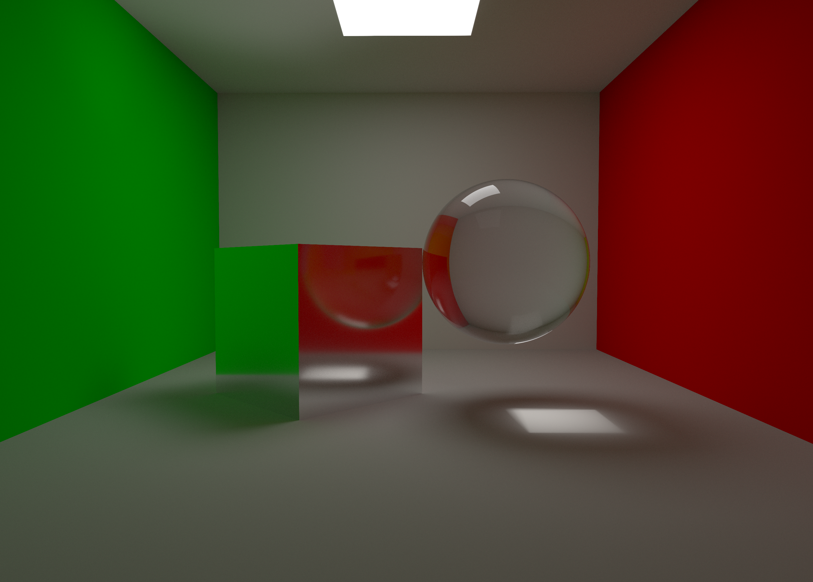
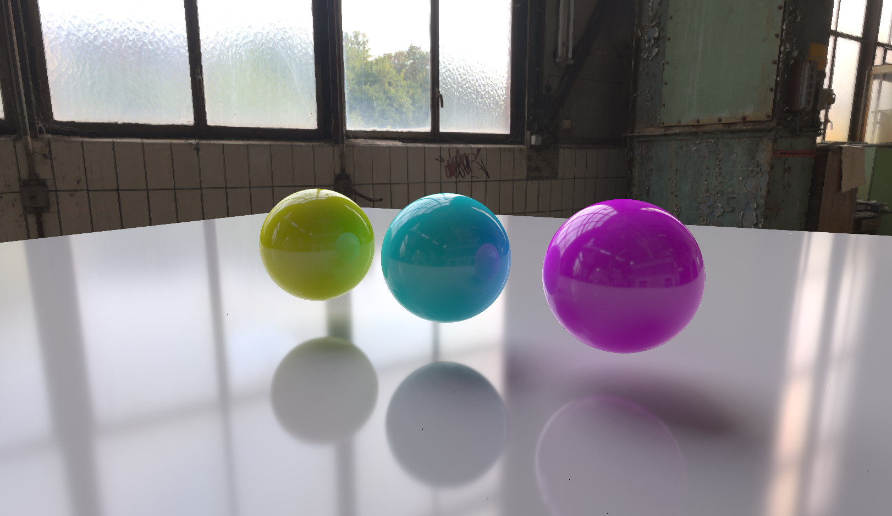
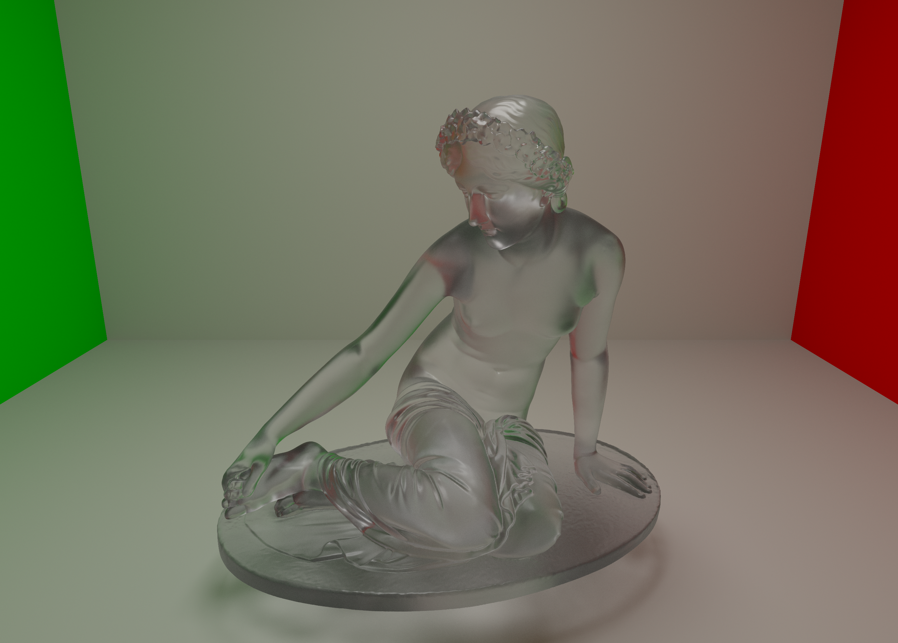

# learnQT
ray tracing using qtopengl
在qt中实现了光追演示程序，目前是微表面演示程序，代码需要自行导入eigen库

光线追踪代码搬运自 https://blog.csdn.net/weixin_44176696/article/details/119044396

qt离线渲染应用 https://blog.csdn.net/imred/article/details/97612963

