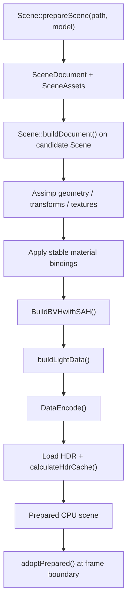
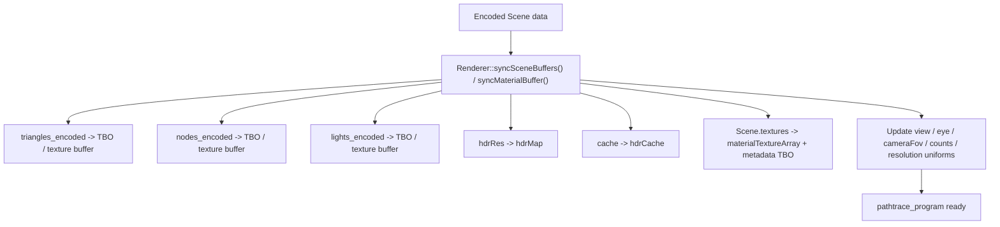
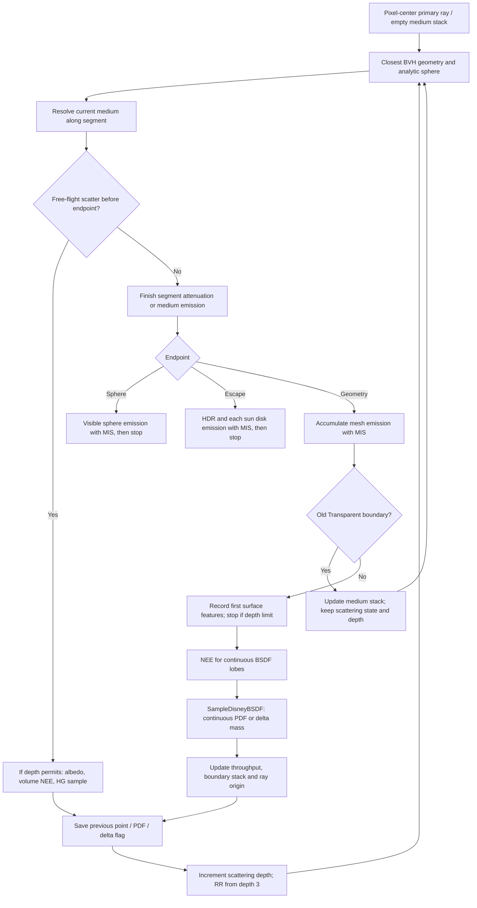

# learnQT 实现逻辑总览

本文档聚焦实现逻辑和当前真实行为，不再重复模块职责或大流程。模块关系请看 [project_architecture.md](./project_architecture.md)，动态流程请看 [render_flow.md](./render_flow.md)。

## 1. 场景准备链路

当前场景准备阶段的真实逻辑是：

- 默认读取 `resources/scenes/bedroom.scene.json`，路灯也是独立 JSON；两者通过同一加载器构建，不再按名称拼装预设。
- `SceneDocument` 保存模型引用、实例矩阵、材质/纹理绑定、灯光、HDR、相机和渲染设置；稳定 ID 不等于运行时纹理编号。
- `MeshLoader` 实际使用 Assimp 读取 OBJ、glTF/GLB、FBX，在 CPU 侧处理节点变换、UV0、法线、切线和图片资源。
- 新模型导入先居中并归一化，再保存实际矩阵；从场景文件加载时不按全场景包围盒重新缩放。
- `BuildBVHwithSAH()` 在 CPU 侧为三角形建立 BVH。
- `Scene::buildLightData()` 在 BVH 三角形排序后建立 light list，再由 `DataEncode()` 编码三角形、BVH 和光源。
- 自发光选择权重使用面积、emissive 常量及贴图平均值，GPU 在实际采样点读取发光贴图；另有场景文件中的 sphere / sun 光源。
- 自发光三角形按双面发光处理，面积到立体角转换使用几何法线的绝对余弦；Mask/Blend 在采样点的覆盖率也参与发光贡献。
- light CDF 使用 double 累加权重，再保存 float CDF；实际相邻区间宽度同时写入 light 编码和对应三角形的 `lightSelectPdf`，避免两侧概率因量化或材质更新而不同步。
- HDR 以亮度乘 texel 精确立体角构建权重；`cache` 的 R/G/B 分别保存 x 边缘 CDF、给定 x 的 y 条件 CDF、两者实际 float 区间宽度的乘积。全黑 HDR 回退为均匀立体角分布。shader 二分选择 texel，在 texel 内连续采样，并让采样返回值与方向回查使用同一个 per-steradian PDF。

一个不太直观但很关键的实现细节是：`nodes` 在构建 BVH 前先塞入了一个占位节点，shader 侧遍历是从索引 `1` 开始的，而不是从 `0` 开始。

首次启动同步准备场景；运行时切换使用后台线程构建独立候选场景，失败不改变当前场景。
保存时从当前状态生成文档快照，不保存 BVH、GPU 编号、累计帧和降噪历史。
加载、原子保存及严格资源边界的便携导出详见 [texture_scene_v1.md](./texture_scene_v1.md)。

## 2. GPU 数据上传链路

这一步的作用不是“生成场景”，而是把 CPU 侧已经准备好的场景同步到 GPU：

- 三角形编码数据走的是 `GL_TEXTURE_BUFFER`；每个三角形为 20 个 `QVector4D`，包含 UV、切线和材质纹理索引。
- BVH 编码数据也走 `GL_TEXTURE_BUFFER`。
- light 编码数据走独立的 `GL_TEXTURE_BUFFER`，shader 侧通过 `lights / nLights` 读取；解析光源位于列表末尾，`nAnalyticLights` 限定解析球求交和太阳盘累积的遍历范围。
- HDR 原图和重要性采样 cache 走 `GL_TEXTURE_2D`。
- 模型图片走 `GL_TEXTURE_2D_ARRAY`，UV 变换及 sampler 参数走元数据 TBO；`baseColorTex` 是 OIDN 辅助输出，不是模型图片。
- 上传时统一 RGBA、尺寸并生成 mipmap，但 shader 当前显式读取 LOD 0，尚未实现完整 minification/自动 LOD。
- 同步完成后，`pathtrace_program` 通过 `samplerBuffer`、`sampler2D` 和 `sampler2DArray` 读取场景。

这里还有一个关键同步点：

- `Renderer::syncSceneBuffers()` / `syncMaterialBuffer()` / `syncCameraUniforms()` 会在 `param_mutex` 保护下读取 `Scene` 和相机状态。
- `GLWidget` 在处理相机输入时也会使用同一个 `param_mutex`。
- 场景替换先取得 `RenderThread::m_frameMutex`，再取得 `param_mutex`；整帧渲染使用同一帧锁，保证候选场景不会在一帧中途覆盖旧数据。
- CPU 候选场景不访问 OpenGL；替换成功后下一帧重新上传 GPU 资源，并清空累计和降噪历史。

这说明当前实现是“粗粒度锁住相机与场景同步”，而不是把相机和场景做成独立的无锁快照。

## 3. shader 内部路径追踪主循环

shader 主循环里最值得记住的点：

- `pathtrace.frag` 对每个像素输出颜色、法线、底色；主射线仍固定经过像素中心，像素内 AA 和景深未实现。
- `normal` 和 `baseColor` 的主要用途不是显示，而是给后面的 OIDN 降噪提供辅助特征。
- baseColor/emissive 做颜色空间转换，metallic/roughness/opacity 按数据通道读取；法线贴图支持切线 handedness、强度和 Y 翻转。
- `Mask` 执行 cutoff，`Blend` 使用随机透过；主射线和阴影复用 BVH alpha 筛选。发光面 NEE 在实际 UV 处将 Mask/Blend 覆盖率乘入辐射度，避免被裁掉的发光区域仍向场景贡献能量。
- `SampleOneLight()` 每个表面或体积散射点总共选择一个显式样本。环境和非环境 light list 同时存在时各选 0.5，只有一类时选 1；后者按功率 CDF 选择三角形、球或太阳盘。
- `pathtrace.glsl` 保存上一真实散射点、连续 PDF 和 delta 标记；透明边界不覆盖这些状态，也不消耗散射深度。三角形、球、太阳盘和 HDR 的发光命中分别查询对应 light PDF；多个重叠太阳盘和 HDR 各自累计，避免重复使用混合辐射度。
- `SampleDisneyBSDF()` 区分连续密度和离散概率质量。纯 delta 跳过 NEE，下一次发光命中的 MIS 权重为 1；混合材质仍对连续波瓣执行 NEE。粗糙度为零的反射/折射、TIR 和 IOR 匹配直通已有回归。
- `medium.glsl` 用最多 8 层 LIFO 栈追踪均匀介质。先处理自由程/吸收/发光，再处理线段末端；体积散射使用 HG 相函数和 NEE/phase MIS，no-event 概率已包含散射消光，不能再重复乘 Beer 衰减。
- `ShadowTransmittance()` 按段乘介质透射率，最多跨越 128 层边界；解析球参与遮挡，采样目标光源通过 ID 排除自遮挡。旧 Transparent 可直穿并更新栈，玻璃 BSDF 边界不会被忽略折射而直穿。
- 表面偏移基于按绕序计算的几何法线与位置尺度，不使用 normal map 判断介质进出。前 3 次散射后启用 RR；透过 alpha/旧 Transparent 的边界不算一次散射。
- `preRenderColorTex` 会把上一轮历史结果喂回当前帧，用于做渐进式累积。

具体 PDF 测度、介质边界和定量结果见 [direct_lighting.md](./direct_lighting.md)。

## 4. 历史帧与后处理逻辑

当前实现把“渲染一轮颜色”和“显示到屏幕”分成了几层：

1. `pathtrace.frag` 负责生成本轮颜色、法线和底色。
2. `historysave.frag` 负责把完整轮次后的颜色结果写回 `preRenderColorTex`。
3. `performDenoising()` 按条件把颜色、法线、底色送进 OIDN。
4. `triangle.frag` 负责最终 tone mapping 和 gamma 校正，并输出到显示用 FBO。
5. `TextureBuffer` 再把结果桥接给主线程的 `paintGL()`。

所以当前显示出来的图像并不是 shader 直接画到窗口上的，而是经历了：

- path tracing
- 可选的历史帧累积
- 可选的 OIDN
- tone mapping / gamma
- 跨线程共享纹理显示

## 5. 当前实现注意点

下面这些都不是“未来可能的问题”，而是当前代码里已经成立的真实行为：

### `Scene::updateMaterial()` 会更新常量材质和 light data，但粒度仍然很粗

UI 上已经有很多材质 slider 和 line edit，也会调用 `learnQT::updateMaterial()`，再进一步调用 `Scene::updateMaterial()`。但是：

- 当前实现会把 UI 中的材质常量写回所有三角形，并同步更新 `triangles_encoded`。
- 更新结束后调用 `buildLightData()`，再把新的 `lightSelectPdf` 回写 `triangles_encoded.textureParam1.z`；渲染线程同步上传三角形和 light buffer，NEE 和 BSDF 命中不会各自保留不同版本的概率。
- 这条路径不会重建 BVH；原有贴图/UV 绑定保留，更新后的常量可随场景保存。它不提供贴图编辑或局部材质选择。

换句话说，材质 UI 当前是“全场景常量材质覆盖”，不是完整的材质编辑系统。

### 渲染线程是持续循环，不是按需渲染

`RenderThread::run()` 里一旦进入主循环，就会持续执行：

- `renderer.render(width, height, snapshot, dirtyFlags)`
- `TextureBuffer::updateTexture(...)`
- `emit imageReady()`

`RenderThread::markSceneDirty()` 只是把 dirty flag 记录到 `m_pendingSceneDirty`，并不会“唤醒一次渲染”。渲染线程下一轮循环会消费这些 flag，所以当前模型更接近“持续 progressive rendering”，而不是“收到事件才渲染一帧”。

达到 `maxRenderFrames` 后，渲染器停止增加累计、继续展示最终图像，线程并不退出；刷新场景或有关参数后重新累计。

### `RenderParams` 和 UI 暴露程度不完全一致

`RenderParams` 里已经有：

- `denoise`
- `renderLow`
- `useTileRendering`
- `useEnvironmentMap`
- `tileSize`
- `maxBounces`
- `maxRenderFrames`（0 表示不限制累计轮次）

但当前 UI 明确暴露出来的主要只有：

- `Denoise`
- `Use Environment Map`
- 最大反弹次数、最大累计帧数
- 一组材质滑块

也就是说，代码内部已经支持分块渲染和 tile size，但界面层没有把这些能力完整暴露出来。

### 环境贴图开关会触发 shader 重建

`Renderer::resolveRefreshActions()` 会比较 `useEnvironmentMap` 的新旧值。一旦变化：

- 调用 `rebuildPathtraceProgram()`
- 通过 `#define USEENVIRONMENTMAP` 决定 fragment shader 的编译分支
- 触发场景 buffer / 相机 uniform 同步，并重置累积

这不是简单切一个 uniform，而是直接重建 path tracing program。

### OIDN 不是每帧都跑

当前 OIDN 调用的节奏偏保守：

- 首帧会做一次完整辅助特征预处理和主过滤。
- 后续一般按“每 100 个完整累计轮次或显式要求刷新”执行。
- 开启降噪时，到达 `maxRenderFrames` 的最终帧也会执行。
- 在 tile 渲染模式下，还要等一整轮 tile 结束后才更有意义。

这有助于减少后处理成本，但也意味着“显示结果更新频率”和“降噪结果更新频率”不是同一件事。

路径中会跳过旧 Transparent 边界，记录首个表面或体积散射点作为辅助特征。但 `pathtrace.frag` 仍将 normal 编码为 `[0, 1]`，读回后尚未恢复到 `[-1, 1]` 就交给 OIDN；这个已知问题及复杂透明/体积路径的特征语义仍在 [to-do.md](./to-do.md)，本轮直接光数值验收不涵盖它们。

### 体积栈的范围有限

当前支持均匀、闭合且正确嵌套的介质边界。相机初始位于介质内时仅通过第一段的背面命中推断一个介质，尚未完整初始化多层栈；任意相交、裁剪及非均匀体积不受支持。栈记录介质消光/散射参数，不记录 IOR；表面仍使用真空与当前材质之间的 IOR 比，不能直接表示不同非真空介质相邻的折射界面。

### `TextureBuffer` 是显示桥，不是渲染目标本体

最终显示图像的生产者仍然是 `Renderer` 的 FBO 和纹理。`TextureBuffer` 的职责只是：

- 由渲染线程更新共享纹理
- 由主线程 `paintGL()` 绘制这张共享纹理

如果后续要查显示错误，需要先区分问题发生在：

- `Renderer` 的 render pass
- `TextureBuffer` 的跨线程桥接
- `GLWidget::paintGL()` 的最终展示
