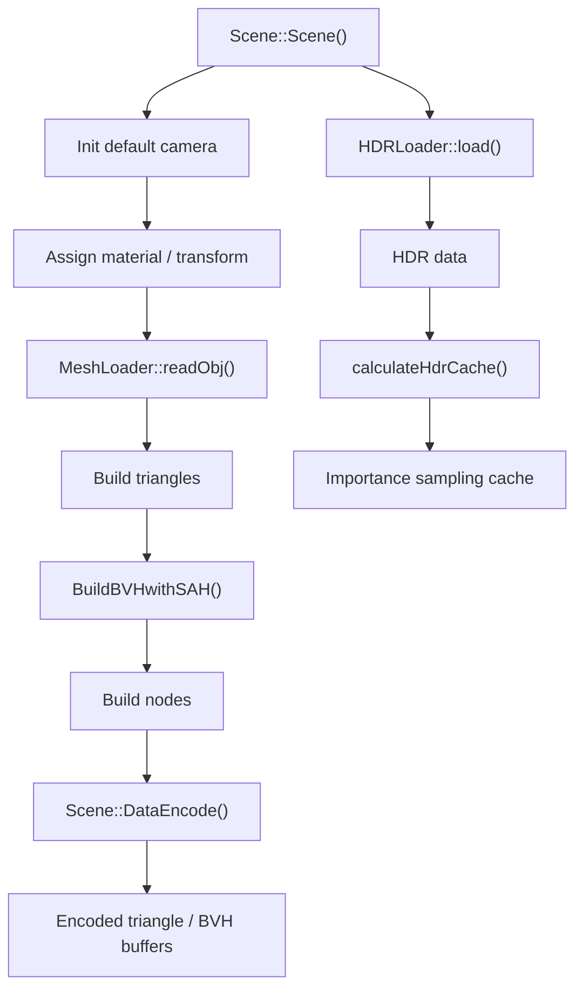
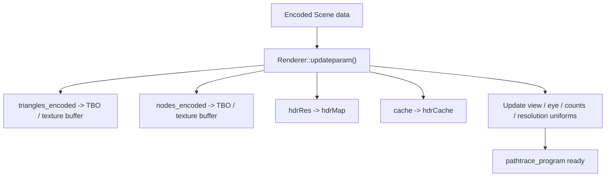
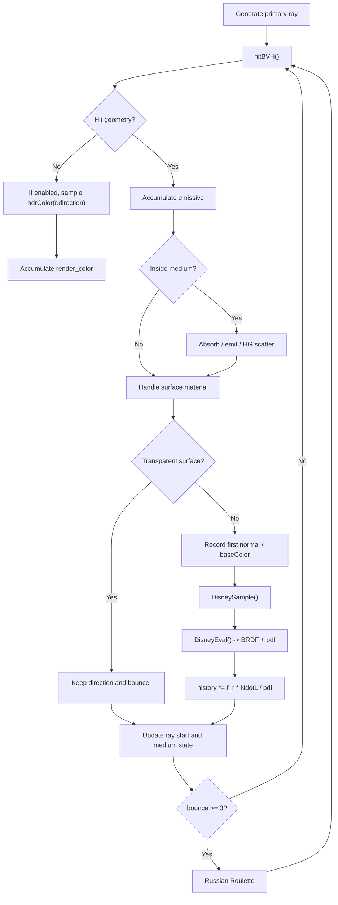

# learnQT 实现逻辑总览

本文档聚焦实现逻辑和当前真实行为，不再重复模块职责或大流程。模块关系请看 [project_architecture.md](./project_architecture.md)，动态流程请看 [render_flow.md](./render_flow.md)。

## 1. 场景准备链路

当前场景准备阶段的真实逻辑是：

- `Scene` 在构造函数里直接拼装默认场景，而不是从独立场景文件加载整套描述。
- 模型几何来自 `resources/models/*.obj`，材质参数和变换矩阵直接写在 `Scene::Scene()` 中。
- `MeshLoader::readObj()` 把 OBJ 转成 `Triangle` 数组，并在 CPU 侧做模型归一化、坐标变换和法线生成。
- `BuildBVHwithSAH()` 在 CPU 侧为三角形建立 BVH。
- `Scene::DataEncode()` 再把三角形和 BVH 压成 shader 可读取的编码格式。
- HDR 贴图除了读取原始数据，还会额外做一份 `cache`，供环境光重要性采样使用。

一个不太直观但很关键的实现细节是：`nodes` 在构建 BVH 前先塞入了一个占位节点，shader 侧遍历是从索引 `1` 开始的，而不是从 `0` 开始。

## 2. GPU 数据上传链路

这一步的作用不是“生成场景”，而是把 CPU 侧已经准备好的场景同步到 GPU：

- 三角形编码数据走的是 `GL_TEXTURE_BUFFER`。
- BVH 编码数据也走 `GL_TEXTURE_BUFFER`。
- HDR 原图和重要性采样 cache 走 `GL_TEXTURE_2D`。
- 同步完成后，`pathtrace_program` 才能通过 `samplerBuffer` 和 `sampler2D` 读取场景。

这里还有一个关键同步点：

- `Renderer::updateparam()` 会在 `param_mutex` 保护下读取 `Scene` 和相机状态。
- `GLWidget` 在处理相机输入时也会使用同一个 `param_mutex`。

这说明当前实现是“粗粒度锁住相机与场景同步”，而不是把相机和场景做成独立的无锁快照。

## 3. shader 内部路径追踪主循环

shader 主循环里最值得记住的点：

- `pathtrace.frag` 对每个像素输出 3 份结果：颜色、法线、底色。
- `normal` 和 `baseColor` 的主要用途不是显示，而是给后面的 OIDN 降噪提供辅助特征。
- 对环境贴图的采样、透明材质、介质散射和 Disney BRDF 都放在同一条 bounce 循环里。
- `preRenderColorTex` 会把上一轮历史结果喂回当前帧，用于做渐进式累积。

## 4. 历史帧与后处理逻辑

当前实现把“渲染一轮颜色”和“显示到屏幕”分成了几层：

1. `pathtrace.frag` 负责生成本轮颜色、法线和底色。
2. `historysave.frag` 负责把完整轮次后的颜色结果写回 `preRenderColorTex`。
3. `performDenoising()` 按条件把颜色、法线、底色送进 OIDN。
4. `triangle.frag` 负责最终 tone mapping 和 gamma 校正，并输出到显示用 FBO。
5. `TextureBuffer` 再把结果桥接给主线程的 `paintGL()`。

所以当前显示出来的图像并不是 shader 直接画到窗口上的，而是经历了：

- path tracing
- 可选的历史帧累积
- 可选的 OIDN
- tone mapping / gamma
- 跨线程共享纹理显示

## 5. 当前实现注意点

下面这些都不是“未来可能的问题”，而是当前代码里已经成立的真实行为：

### `Scene::updateMaterial()` 目前基本没有生效

UI 上已经有很多材质 slider 和 line edit，也会调用 `learnQT::updateMaterial()`，再进一步调用 `Scene::updateMaterial()`。但是：

- `Scene::updateMaterial()` 主体逻辑目前被注释掉了。
- 这意味着材质面板虽然会触发 `sendM()`，但编码后的三角形材质并没有真正被更新。

换句话说，材质 UI 当前更像“接线已经搭好，但核心实现尚未完成”。

### 渲染线程是持续循环，不是按需渲染

`RenderThread::run()` 里一旦进入主循环，就会持续执行：

- `renderer.render(width, height)`
- `TextureBuffer::updateTexture(...)`
- `emit imageReady()`

`recMegFromMain()` 只是把 `Renderer.needupdate` 设为 `true`，并不会“唤醒一次渲染”。因此当前模型更接近“持续 progressive rendering”，而不是“收到事件才渲染一帧”。

### `RenderParams` 和 UI 暴露程度不完全一致

`RenderParams` 里已经有：

- `denoise`
- `renderLow`
- `useTileRendering`
- `useEnvironmentMap`
- `tileSize`

但当前 UI 明确暴露出来的主要只有：

- `Denoise`
- `Use Environment Map`
- 一组材质滑块

也就是说，代码内部已经支持分块渲染和 tile size，但界面层没有把这些能力完整暴露出来。

### 环境贴图开关会触发 shader 重建

`Renderer::updateRenderParameters()` 会比较 `useEnvironmentMap` 的新旧值。一旦变化：

- 调用 `rebuildPathtraceProgram()`
- 通过 `#define USEENVIRONMENTMAP` 决定 fragment shader 的编译分支
- 再把 `needupdate` 设为 `true`

这不是简单切一个 uniform，而是直接重建 path tracing program。

### OIDN 不是每帧都跑

当前 OIDN 调用的节奏偏保守：

- 首帧会做一次完整辅助特征预处理和主过滤。
- 后续一般按“每 100 帧或显式要求刷新”执行。
- 在 tile 渲染模式下，还要等一整轮 tile 结束后才更有意义。

这有助于减少后处理成本，但也意味着“显示结果更新频率”和“降噪结果更新频率”不是同一件事。

### `TextureBuffer` 是显示桥，不是渲染目标本体

最终显示图像的生产者仍然是 `Renderer` 的 FBO 和纹理。`TextureBuffer` 的职责只是：

- 由渲染线程更新共享纹理
- 由主线程 `paintGL()` 绘制这张共享纹理

如果后续要查显示错误，需要先区分问题发生在：

- `Renderer` 的 render pass
- `TextureBuffer` 的跨线程桥接
- `GLWidget::paintGL()` 的最终展示
