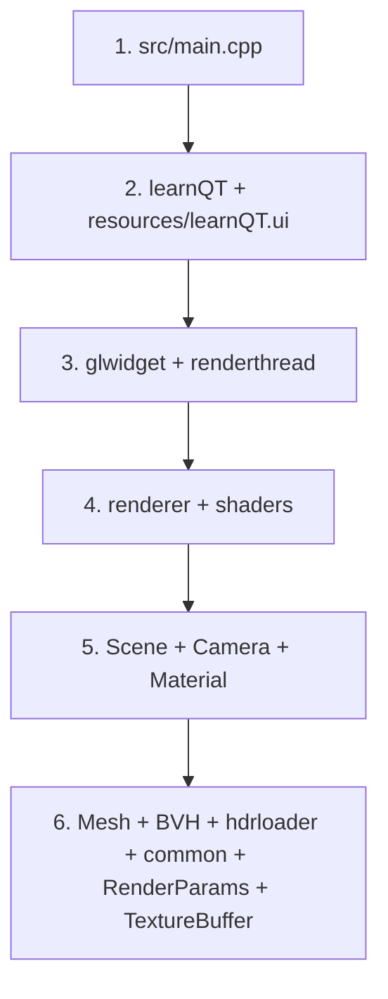

# learnQT 代码阅读地图

本文档不重复讲流程和架构，而是把“应该读哪些文件、为什么读、改动会影响哪里”整理成一个可落地的阅读入口。静态结构请看 [project_architecture.md](./project_architecture.md)，实现逻辑请看 [logic_overview.md](./logic_overview.md)。

## 建议阅读顺序

这条顺序的意图是先回答“程序怎么启动”，再回答“渲染是谁驱动的”，最后再下潜到几何、加速结构和底层工具。

## 关键模块地图

| 范围 | 关键文件 | 这部分解决什么问题 | 应该先读什么 | 它依赖谁 | 改它会影响谁 |
| --- | --- | --- | --- | --- | --- |
| 程序入口 | [`src/main.cpp`](../src/main.cpp) | 进程入口，创建 `QApplication` 和主窗口。 | 从这里开始。 | Qt | 启动时机、窗口生命周期 |
| 主窗口与 UI | [`include/learnQT.h`](../include/learnQT.h), [`src/learnQT.cpp`](../src/learnQT.cpp), [`resources/learnQT.ui`](../resources/learnQT.ui) | 组织主窗口、绑定控件、把 UI 输入接到渲染系统。 | 读完 `main.cpp` 后立刻读。 | Qt、`GLWidget`、`Scene`、`RenderParams` | 控件行为、信号槽、初始化顺序 |
| 显示层与输入层 | [`include/glwidget.h`](../include/glwidget.h), [`src/glwidget.cpp`](../src/glwidget.cpp) | 在主线程显示渲染结果、接收键鼠事件、启动渲染线程。 | 先理解 `learnQT` 怎么把 `GLWidget` 放进 UI。 | `RenderThread`、`Scene`、`TextureBuffer`、Qt OpenGL | 相机交互、显示刷新、线程启动 |
| 渲染线程桥接 | [`include/renderthread.h`](../include/renderthread.h), [`src/renderthread.cpp`](../src/renderthread.cpp) | 创建共享 OpenGL context，维持 worker 循环，把渲染结果发回 UI。 | 读完 `GLWidget` 再读。 | `Renderer`、`TextureBuffer`、`RenderParams` | 线程生命周期、worker 循环、降噪切换 |
| 核心渲染器 | [`include/renderer.h`](../include/renderer.h), [`src/renderer.cpp`](../src/renderer.cpp) | 管理 shader、FBO、纹理、TBO、PBO、OIDN、分块渲染和最终合成。 | 先知道 `RenderThread` 如何调用它。 | `Scene`、`RenderParams`、`common`、OIDN、Eigen、OpenGL | 画面结果、性能、分辨率、后处理 |
| shader 入口与 include | [`shaders/pathtrace.frag`](../shaders/pathtrace.frag), [`shaders/historysave.frag`](../shaders/historysave.frag), [`shaders/triangle.frag`](../shaders/triangle.frag), [`shaders/include/`](../shaders/include) | 真正决定路径追踪结果、历史帧保存和最终显示；`light_sampling.glsl` 负责直接光采样和 light PDF。 | 先读 `renderer.cpp` 里怎么绑定 uniform 和纹理。 | `Renderer` 上传的数据布局 | 光照、MIS、采样、BVH 遍历、显示后处理 |
| 场景与相机 | [`include/Scene.h`](../include/Scene.h), [`src/Scene.cpp`](../src/Scene.cpp), [`include/Camera.h`](../include/Camera.h), [`src/Camera.cpp`](../src/Camera.cpp), [`include/Material.h`](../include/Material.h) | 保存默认场景、相机状态、材质参数、emissive triangle light list，并提供编码后的 GPU 输入。 | 先知道 `Renderer` 需要从 `Scene` 取什么。 | `MeshLoader`、`BuildBVH`、`HDRLoader`、`common` | 场景内容、相机交互、材质语义、光源采样分布 |
| 几何读取与 BVH | [`include/Mesh.h`](../include/Mesh.h), [`src/Mesh.cpp`](../src/Mesh.cpp), [`include/BVH.h`](../include/BVH.h), [`src/BVH.cpp`](../src/BVH.cpp) | OBJ 读取、变换、法线生成和 BVH SAH 构建。 | 读完 `Scene.cpp` 再下沉。 | `Material`、`common` | 几何正确性、交点性能、场景导入行为 |
| 公共参数与桥接 | [`include/RenderParams.h`](../include/RenderParams.h), [`src/RenderParams.cpp`](../src/RenderParams.cpp), [`include/texturebuffer.h`](../include/texturebuffer.h), [`src/texturebuffer.cpp`](../src/texturebuffer.cpp) | 一个负责跨线程参数同步，一个负责跨线程显示桥接。 | 读完 `GLWidget` 和 `RenderThread` 最容易懂。 | Qt、OpenGL | 参数同步、主线程显示稳定性 |
| 底层工具与资源路径 | [`include/common.h`](../include/common.h), [`src/common.cpp`](../src/common.cpp), [`include/hdrloader.h`](../include/hdrloader.h), [`src/hdrloader.cpp`](../src/hdrloader.cpp), [`CMakeLists.txt`](../CMakeLists.txt) | 提供 HDR cache、Sobol 采样、资源路径、HDR 读取和构建配置。 | 作为辅助阅读，不要最先啃。 | Qt、标准库、OpenGL 宏定义 | 采样质量、资源定位、构建环境 |

## 如果你要回答某类问题，应该先看哪里

| 你想回答的问题 | 优先看哪些文件 |
| --- | --- |
| 程序从哪里启动、谁先初始化 | `src/main.cpp`, `src/learnQT.cpp`, `src/Scene.cpp`, `src/glwidget.cpp` |
| 谁驱动渲染、谁负责显示 | `src/glwidget.cpp`, `src/renderthread.cpp`, `src/renderer.cpp`, `src/texturebuffer.cpp` |
| 一帧图像到底经过哪些 pass | `src/renderer.cpp`, `shaders/pathtrace.frag`, `shaders/historysave.frag`, `shaders/triangle.frag` |
| 几何和 BVH 怎么进 shader | `src/Scene.cpp`, `src/Mesh.cpp`, `src/BVH.cpp`, `src/renderer.cpp`, `shaders/include/bvh_material.glsl` |
| 相机为什么这样运动 | `src/glwidget.cpp`, `src/Camera.cpp` |
| 某个 UI 控件为什么没效果 | `include/learnQT.h`, `src/learnQT.cpp`, `src/Scene.cpp`, `src/renderer.cpp` |
| MIS 或直接光采样为什么偏亮/偏暗 | `src/common.cpp`, `src/Scene.cpp`, `src/renderer.cpp`, `shaders/include/hdr_utils.glsl`, `shaders/include/light_sampling.glsl`, `shaders/include/pathtrace.glsl` |

## 当前最值得优先掌握的文件

如果时间有限，先把下面 6 个文件看明白，基本就能把项目主线串起来：

1. [`src/main.cpp`](../src/main.cpp)
2. [`src/learnQT.cpp`](../src/learnQT.cpp)
3. [`src/glwidget.cpp`](../src/glwidget.cpp)
4. [`src/renderthread.cpp`](../src/renderthread.cpp)
5. [`src/renderer.cpp`](../src/renderer.cpp)
6. [`src/Scene.cpp`](../src/Scene.cpp)

读完这 6 个文件以后，再去看：

- `src/Mesh.cpp` 和 `src/BVH.cpp`，补齐场景准备链路。
- `shaders/pathtrace.frag`、`shaders/include/pathtrace.glsl` 和 `shaders/include/light_sampling.glsl`，补齐 GPU 侧路径追踪与 MIS 行为。
- `src/common.cpp`，补齐 Sobol、HDR cache 和资源路径这类底层细节。

## 阅读时的注意点

- `Scene` 是单例，理解它时要同时看“构造阶段准备了什么”和“渲染阶段读取了什么”。
- `RenderParams` 看起来像参数中心，但不是所有 UI 行为都落在这里；相机状态仍然直接写 `Scene::camera`。
- `Assimp` 在 `CMakeLists.txt` 里存在，但当前核心装载路径还是自写 OBJ 解析，不要一开始把注意力放错地方。
- `Renderer` 文件很长，但可以按 “初始化 / 参数同步 / render pass / 降噪 / 最终合成” 五段来拆读。
