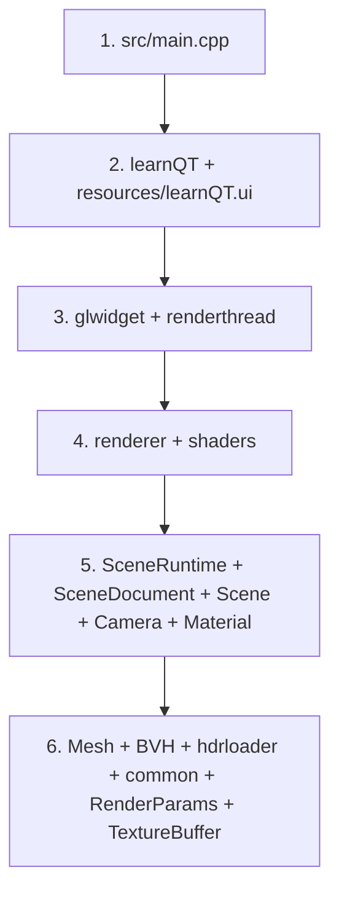

# learnQT 代码阅读地图

本文档不重复讲流程和架构，而是把“应该读哪些文件、为什么读、改动会影响哪里”整理成一个可落地的阅读入口。静态结构请看 [project_architecture.md](./project_architecture.md)，实现逻辑请看 [logic_overview.md](./logic_overview.md)。

## 建议阅读顺序

这条顺序的意图是先回答“程序怎么启动”，再回答“渲染是谁驱动的”，最后再下潜到几何、加速结构和底层工具。

## 关键模块地图

| 范围 | 关键文件 | 这部分解决什么问题 | 应该先读什么 | 它依赖谁 | 改它会影响谁 |
| --- | --- | --- | --- | --- | --- |
| 程序入口 | [`src/main.cpp`](../src/main.cpp) | 创建 Qt 应用；解析互斥的 `--scene` / `--model`、保存/导出/验证及渲染回归参数。 | 从这里开始。 | Qt、场景接口 | 启动时机、命令行、窗口生命周期 |
| 主窗口与 UI | [`include/learnQT.h`](../include/learnQT.h), [`src/learnQT.cpp`](../src/learnQT.cpp), [`resources/learnQT.ui`](../resources/learnQT.ui) | 控件绑定、场景列表和读写、dirty 提示、后台加载、失败恢复。 | 读完 `main.cpp` 后立刻读。 | Qt、`GLWidget`、`Scene`、`RenderParams` | 切换/保存行为、信号槽、初始化顺序 |
| 显示层与输入层 | [`include/glwidget.h`](../include/glwidget.h), [`src/glwidget.cpp`](../src/glwidget.cpp) | 在主线程显示渲染结果、接收键鼠事件、启动渲染线程。 | 先理解 `learnQT` 怎么把 `GLWidget` 放进 UI。 | `RenderThread`、`Scene`、`TextureBuffer`、Qt OpenGL | 相机交互、显示刷新、线程启动 |
| 渲染线程桥接 | [`include/renderthread.h`](../include/renderthread.h), [`src/renderthread.cpp`](../src/renderthread.cpp) | 创建共享 OpenGL context，维持 worker 循环，把渲染结果发回 UI。 | 读完 `GLWidget` 再读。 | `Renderer`、`TextureBuffer`、`RenderParams` | 线程生命周期、worker 循环、降噪切换 |
| 核心渲染器 | [`include/renderer.h`](../include/renderer.h), [`src/renderer.cpp`](../src/renderer.cpp) | 管理 shader、FBO、纹理、TBO、PBO、OIDN、分块渲染和最终合成。 | 先知道 `RenderThread` 如何调用它。 | `Scene`、`RenderParams`、`common`、OIDN、Eigen、OpenGL | 画面结果、性能、分辨率、后处理 |
| shader 入口与 include | [`shaders/pathtrace.frag`](../shaders/pathtrace.frag), [`shaders/historysave.frag`](../shaders/historysave.frag), [`shaders/triangle.frag`](../shaders/triangle.frag), [`shaders/include/`](../shaders/include) | 路径追踪、历史帧保存和最终显示；表面/体积直接光、delta 和介质状态在下方专题入口细分。 | 先读 `renderer.cpp` 里怎么绑定 uniform 和纹理。 | `Renderer` 上传的数据布局 | 光照、MIS、采样、BVH 遍历、显示后处理 |
| 场景与相机 | [`include/Scene.h`](../include/Scene.h), [`src/Scene.cpp`](../src/Scene.cpp), [`src/SceneRuntime.cpp`](../src/SceneRuntime.cpp), [`include/Camera.h`](../include/Camera.h), [`src/Camera.cpp`](../src/Camera.cpp), [`include/Material.h`](../include/Material.h) | 从文档构建候选运行时、替换与快照；维护材质、纹理、灯光和 GPU 编码，恢复相机轨道状态。 | 先看 `prepareScene()` / `buildDocument()`，再看 `Renderer` 所需数据。 | `SceneDocument`、`SceneAssets`、`MeshLoader`、BVH、HDR | 场景生命周期、材质语义、光源分布、相机交互 |
| 场景文档与便携包 | [`include/SceneDocument.h`](../include/SceneDocument.h), [`src/SceneDocument.cpp`](../src/SceneDocument.cpp) | 版本验证、稳定 ID、路径重定位、原子保存、资源包验证后发布。 | 与 `SceneRuntime.cpp` 配合阅读。 | Qt JSON/文件系统、`SceneAssets`、运行时验证 | 格式兼容、保存安全性、可搬移性 |
| 资源解析与依赖 | [`include/SceneAssets.h`](../include/SceneAssets.h), [`src/SceneAssets.cpp`](../src/SceneAssets.cpp) | Unicode 路径、Assimp IO、依赖闭包和别名、严格包内访问边界。 | 从模型导入和包导出两个调用点阅读。 | QFile、Assimp IOSystem | 外部/内嵌资源、同名冲突、禁止原路径回退 |
| 几何读取与 BVH | [`include/Mesh.h`](../include/Mesh.h), [`src/Mesh.cpp`](../src/Mesh.cpp), [`include/BVH.h`](../include/BVH.h), [`src/BVH.cpp`](../src/BVH.cpp) | Assimp 导入 OBJ/glTF/GLB/FBX、节点变换、UV0/法线/切线/材质纹理，以及 BVH SAH 构建。 | 读完 `SceneRuntime.cpp` 再下沉。 | Assimp、`SceneAssets`、`Material`、`common` | 几何与贴图正确性、交点性能、导入行为 |
| 公共参数与桥接 | [`include/RenderParams.h`](../include/RenderParams.h), [`src/RenderParams.cpp`](../src/RenderParams.cpp), [`include/texturebuffer.h`](../include/texturebuffer.h), [`src/texturebuffer.cpp`](../src/texturebuffer.cpp) | 一个负责跨线程参数同步，一个负责跨线程显示桥接。 | 读完 `GLWidget` 和 `RenderThread` 最容易懂。 | Qt、OpenGL | 参数同步、主线程显示稳定性 |
| 底层工具与资源路径 | [`include/common.h`](../include/common.h), [`src/common.cpp`](../src/common.cpp), [`include/hdrloader.h`](../include/hdrloader.h), [`src/hdrloader.cpp`](../src/hdrloader.cpp), [`CMakeLists.txt`](../CMakeLists.txt) | 提供 HDR cache、Sobol 采样、资源路径、HDR 读取和构建配置。 | 作为辅助阅读，不要最先啃。 | Qt、标准库、OpenGL 宏定义 | 采样质量、资源定位、构建环境 |
| 预设与回归 | [`resources/scenes/`](../resources/scenes), [`tests/`](../tests), [`CMakeLists.txt`](../CMakeLists.txt) | 卧室/路灯预设；9 项 CTest 覆盖导入、场景往返/便携包、实际 UI 切换、GPU 像素检查和光照数值回归。 | 看 [v1 验收说明](./texture_scene_v1.md) 和 [直接光验收](./direct_lighting.md)。 | 测试资源、Qt/OpenGL、Python | 资源可复现性、格式、采样能量和画面回归 |

## 直接光采样代码入口

| 入口 | 负责行为 | 联动修改与验证 |
| --- | --- | --- |
| [`src/Scene.cpp`](../src/Scene.cpp)、[`src/renderer.cpp`](../src/renderer.cpp) | light CDF、三角形选择概率回写、light/triangle buffer 与 `nAnalyticLights` 同步 | 概率与编码一起检查；[`SceneTests.cpp`](../tests/SceneTests.cpp) 覆盖材质修改后的两侧概率一致性 |
| [`src/common.cpp`](../src/common.cpp)、[`hdr_utils.glsl`](../shaders/include/hdr_utils.glsl) | CPU 边缘/条件 CDF、GPU 二分与 texel 内采样、方向 PDF 回查 | cache 通道语义必须同时修改；验证黑图、非 2:1、亮点和极区 |
| [`light_sampling.glsl`](../shaders/include/light_sampling.glsl) | 环境/三角形/球/太阳盘采样、对应 PDF、解析球求交 | 与 `pathtrace.glsl` 的发光命中及 `medium.glsl` 的遮挡保持一致 |
| [`bsdf.glsl`](../shaders/include/bsdf.glsl) | 连续 Disney/GGX 波瓣、delta 反射/折射与混合概率质量 | 检查纯 delta 跳过 NEE、混合材质连续 NEE、TIR 和 IOR 匹配直通 |
| [`medium.glsl`](../shaders/include/medium.glsl) | 8 层介质栈、边界进出、Beer 透射率和最多 128 层阴影查询 | 依赖 BVH 几何法线及 alpha 筛选；覆盖嵌套恢复、目标光源自遮挡与球遮挡 |
| [`pathtrace.glsl`](../shaders/include/pathtrace.glsl) | 自由程/介质发光、表面/体积 NEE、发光命中 MIS、前一散射状态及 RR | 线段介质处理必须先于端点发光；透明边界保留前一散射 PDF/位置 |
| [`bvh_material.glsl`](../shaders/include/bvh_material.glsl)、[`utils.glsl`](../shaders/include/utils.glsl) | alpha 命中筛选、绕序几何法线、位置尺度偏移及稳定 MIS 运算 | 着色法线和几何法线用途不同；极端尺度与复杂法线仍需专项回归 |
| [`LightingTests.cpp`](../tests/LightingTests.cpp)、[`CMakeLists.txt`](../CMakeLists.txt) | `lighting_numerical_regression`，用实际 OpenGL shader 对照解析值与同样本方差 | 可经 CTest 单独运行；完整命令、结果和限制见 [direct_lighting.md](./direct_lighting.md) |

## 如果你要回答某类问题，应该先看哪里

| 你想回答的问题 | 优先看哪些文件 |
| --- | --- |
| 程序从哪里启动、谁先初始化 | `src/main.cpp`, `src/learnQT.cpp`, `src/Scene.cpp`, `src/glwidget.cpp` |
| 谁驱动渲染、谁负责显示 | `src/glwidget.cpp`, `src/renderthread.cpp`, `src/renderer.cpp`, `src/texturebuffer.cpp` |
| 一帧图像到底经过哪些 pass | `src/renderer.cpp`, `shaders/pathtrace.frag`, `shaders/historysave.frag`, `shaders/triangle.frag` |
| 几何和 BVH 怎么进 shader | `src/Scene.cpp`, `src/Mesh.cpp`, `src/BVH.cpp`, `src/renderer.cpp`, `shaders/include/bvh_material.glsl` |
| 场景如何保存、切换和恢复失败 | `src/learnQT.cpp`, `src/SceneRuntime.cpp`, `src/SceneDocument.cpp`, `src/renderthread.cpp` |
| 便携包为什么缺图或仍依赖原路径 | `src/SceneAssets.cpp`, `src/SceneDocument.cpp`, `tests/SceneTests.cpp` |
| 模型贴图为何黑色、错位或法线方向错误 | `src/Mesh.cpp`, `src/renderer.cpp`, `shaders/include/bvh_material.glsl`, `tests/test_texture_rendering_support.py` |
| 相机为什么这样运动 | `src/glwidget.cpp`, `src/Camera.cpp` |
| 某个 UI 控件为什么没效果 | `include/learnQT.h`, `src/learnQT.cpp`, `src/Scene.cpp`, `src/renderer.cpp` |
| MIS 或直接光采样为什么偏亮/偏暗 | `src/common.cpp`, `src/Scene.cpp`, `src/renderer.cpp`, `shaders/include/hdr_utils.glsl`, `shaders/include/light_sampling.glsl`, `shaders/include/pathtrace.glsl` |
| 嵌套介质、体积直接光或玻璃路径为何异常 | `shaders/include/medium.glsl`, `shaders/include/pathtrace.glsl`, `shaders/include/bsdf.glsl`, `tests/LightingTests.cpp`；先核对 [支持边界](./direct_lighting.md) |

## 当前最值得优先掌握的文件

如果时间有限，先把下面 6 个文件看明白，基本就能把项目主线串起来：

1. [`src/main.cpp`](../src/main.cpp)
2. [`src/learnQT.cpp`](../src/learnQT.cpp)
3. [`src/glwidget.cpp`](../src/glwidget.cpp)
4. [`src/renderthread.cpp`](../src/renderthread.cpp)
5. [`src/renderer.cpp`](../src/renderer.cpp)
6. [`src/Scene.cpp`](../src/Scene.cpp)

读完这 6 个文件以后，再去看：

- `src/Mesh.cpp` 和 `src/BVH.cpp`，补齐场景准备链路。
- `src/SceneRuntime.cpp`、`src/SceneDocument.cpp` 和 `src/SceneAssets.cpp`，补齐场景保存、候选加载及资源包生命周期。
- `shaders/pathtrace.frag`、`shaders/include/pathtrace.glsl`、`shaders/include/light_sampling.glsl`、`shaders/include/medium.glsl` 和 `shaders/include/bsdf.glsl`，补齐 GPU 侧表面/体积路径追踪与 MIS 行为。
- `src/common.cpp`，补齐 Sobol、HDR cache 和资源路径这类底层细节。

## 阅读时的注意点

- 当前活动场景通过 `Scene::getInstance()` 访问，但后台加载会建立独立的候选 `Scene`；不要把每一个 `Scene` 对象都当成单例。
- `RenderParams` 看起来像参数中心，但不是所有 UI 行为都落在这里；相机状态仍然直接写 `Scene::camera`。
- `Assimp` 已是实际模型导入路径；切线 fallback 不等于独立参考 MikkTSpace，各格式边界见 [texture_scene_v1.md](./texture_scene_v1.md)。
- `Renderer` 文件很长，但可以按 “初始化 / 参数同步 / render pass / 降噪 / 最终合成” 五段来拆读。
