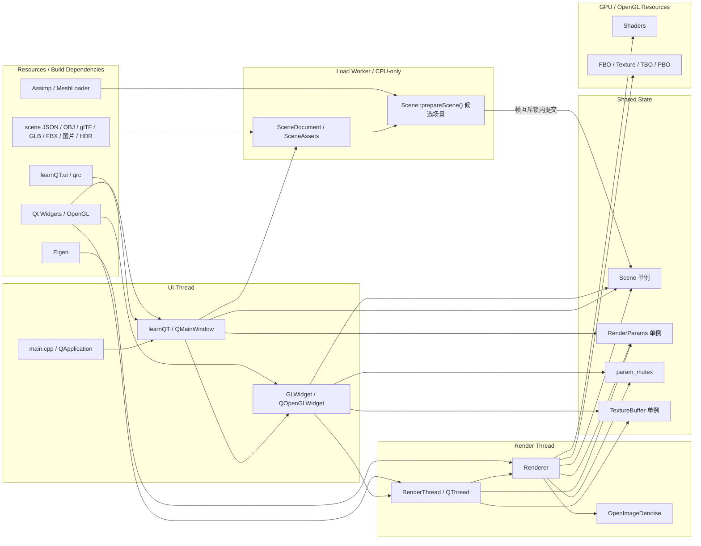
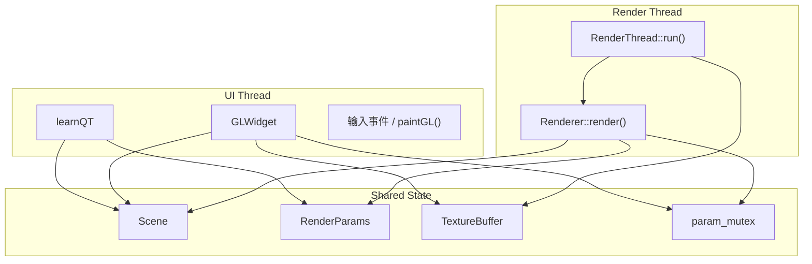

# learnQT 项目静态架构

本文档只描述项目的静态结构：模块关系、线程边界、共享状态归属，以及第三方依赖在当前实现中的位置。动态执行过程请看 [render_flow.md](./render_flow.md)。

## 总体结构图

这张图要点如下：

- `learnQT` 是 UI 顶层窗口，负责创建界面控件、连接信号槽，并在构造阶段触发 `Scene::getInstance()`。
- `GLWidget` 仍在 `UI Thread` 中，但它不是渲染核心；它更像一个显示层和交互层，用来启动 `RenderThread`、接收 `imageReady()`，以及把输入事件转成对 `Scene` 或 `RenderParams` 的更新。
- `RenderThread` 持有共享的 OpenGL context，并持续调用 `Renderer::render()`。
- `Renderer` 是真正的渲染核心，负责 shader 管理、FBO/纹理/TBO/PBO、场景数据上传、路径追踪 pass、历史帧保存、OIDN 降噪和最终合成。
- `Scene`、`RenderParams`、`TextureBuffer`、`param_mutex` 是跨模块的共享点。
- `SceneDocument` 是可保存的 CPU 描述，`SceneAssets` 统一解析模型依赖。后台任务构建独立 `Scene(false)`，成功后才替换当前单例。
- 首次启动的 CPU 准备仍同步发生在窗口构造阶段；上图的 `Load Worker` 用于运行期间的加载及导出。

## 线程边界

当前实现的线程边界很明确：

- `learnQT` 和 `GLWidget` 只在 Qt 主线程里跑。
- `RenderThread::run()` 和 `Renderer` 在渲染 worker 中执行；`markSceneDirty()`、`replaceScene()` 等控制入口由主线程调用。
- `QThread::create()` 创建的加载任务只处理独立候选场景、模型/贴图、BVH 和 HDR cache；不操作 GPU，也不在构建时改写当前 `RenderParams`。
- `Scene` 不是线程安全容器本身；它依赖全局 `param_mutex` 做部分保护。
- `RenderParams` 通过 `std::atomic` 保存参数，本身比 `Scene` 更适合跨线程读写。
- `TextureBuffer` 用内部 `QMutex` 保护跨线程共享纹理的更新和绘制。
- `RenderThread::m_frameMutex` 覆盖帧执行与场景替换；提交候选场景时先取得该锁，再取得 `param_mutex`。不要反向持锁调用替换接口。

## 核心模块职责

| 模块 | 职责 | 上游 | 下游 |
| --- | --- | --- | --- |
| `main.cpp` | 解析互斥的 `--scene` / `--model`、保存/导出/验证入口，创建 Qt 主窗口。 | 进程入口 | `learnQT`、`Scene` |
| `learnQT` | 管理场景列表、未保存状态与确认框、后台加载/导出、控件恢复及 UI 参数更新。 | `main.cpp` | `GLWidget`、`Scene`、`RenderParams` |
| `GLWidget` | 在主线程中显示最终图像，接收键鼠输入，创建并启动 `RenderThread`。 | `learnQT` | `RenderThread`、`Scene`、`TextureBuffer` |
| `RenderThread` | 建立共享 OpenGL context，驱动持续渲染循环，并把结果通知主线程刷新。 | `GLWidget` | `Renderer`、`TextureBuffer` |
| `Renderer` | 渲染核心，管理 GPU 资源、shader、OIDN、路径追踪 pass 和合成 pass。 | `RenderThread` | GPU 资源、`TextureBuffer` |
| `Scene` | 场景单例，保存相机、三角形、BVH、HDR、light list 和编码后的 GPU 输入。 | `learnQT`、`GLWidget` | `Renderer` |
| `SceneDocument` | 版本化 JSON、稳定 ID、相机/参数快照、验证、原子保存及便携导出。 | `Scene`、`learnQT` | `SceneRuntime.cpp`、`SceneAssets` |
| `SceneAssets` | Assimp 文件 IO 与图片依赖解析、路径别名记录、便携包根目录限制。 | `SceneRuntime.cpp` | `MeshLoader`、文件资源 |
| `RenderParams` | 跨线程参数注册表，保存是否降噪、低分辨率、分块渲染、环境贴图开关等。 | `learnQT`、`RenderThread` | `Renderer` |
| `TextureBuffer` | 作为显示桥接层，接收渲染线程输出并供主线程 `paintGL()` 绘制。 | `RenderThread` | `GLWidget` |

## 共享状态归属

| 状态 | 创建位置 | 主要写入方 | 主要读取方 | 同步方式 |
| --- | --- | --- | --- | --- |
| 当前 `Scene` | 构造阶段加载默认卧室或 CLI 指定文档/模型 | 候选提交、相机输入、材质更新 | `Renderer` 的 scene/material/camera 同步入口 | 场景读写用 `param_mutex`；整体替换另受 `m_frameMutex` 保护 |
| 候选 `Scene` | `Scene::prepareScene()` | 启动准备或 Load Worker | 完成回调/场景提交 | 构建阶段由单个任务独占，不共享半成品 |
| `RenderParams` | `RenderParams::instance()` | `learnQT` 的 UI 槽函数、`GLWidget` 的交互降分辨率 | `Renderer::resolveRefreshActions()` | 内部 `std::atomic` |
| `TextureBuffer` | `TextureBuffer::instance()` | `RenderThread` | `GLWidget::paintGL()` | 内部 `QMutex` |
| `param_mutex` | 全局对象，定义在 `src/glwidget.cpp` | `learnQT`、`GLWidget`、`Renderer` | 同上 | 粗粒度互斥 |

这里最重要的理解是：

- 当前 `Scene` 保存“重资产”运行时数据；其中的 `SceneDocument` 保存可持久化描述。GPU 编号、BVH 和累计帧不写入 JSON。
- `RenderParams` 保存的是“轻量控制参数”，例如是否降噪、是否低分辨率、tile size 等。
- `TextureBuffer` 不负责渲染，只负责把 worker 线程的最终图像安全地带回主线程显示。

## 光照采样数据与路径状态

| 层级 | 当前职责 | 数据边界 |
| --- | --- | --- |
| CPU 场景准备 | `Scene::buildLightData()` 构建发光三角形和解析 sphere / sun 的功率选择 CDF；`calculateHdrCache()` 构建环境贴图的边缘/条件 CDF | 灯光编码及三角形内的选择概率必须同步；HDR cache 保存 CDF 与实际区间概率，不再保存预选 UV |
| Render Thread 上传 | `syncSceneBuffers()` / `syncMaterialBuffer()` 上传三角形、light TBO 与数量 uniform；HDR 原图与 cache 在场景同步时上传 | `nAnalyticLights` 标记 light list 尾部的解析光源数量，供主射线/间接射线求交与环境逃逸累积使用 |
| GPU 光照采样 | `hdr_utils.glsl`、`light_sampling.glsl` 提供环境/三角形/球/太阳盘采样与 PDF；`bsdf.glsl` 区分连续波瓣和 delta 事件 | 表面 NEE 与 BSDF 命中、体积 NEE 与 phase 命中使用一致的选择概率和方向 PDF |
| GPU 单条路径 | `pathtrace.glsl` 保存 throughput、上一散射点、PDF、delta 标记和 `MediumStack`；`medium.glsl` 管理边界与阴影透射率 | 最多 8 层均匀介质，栈属于单条路径；阴影查询按值复制它，不修改主路径状态，也不写回 CPU 场景 |

材质编辑后 CPU 会重建 light CDF，并把新概率回写到三角形编码；下一帧同时上传三角形和光源缓冲、重置累计。该操作不重建 BVH，但材质和几何数据尚未拆成独立 GPU 表，仍上传整份三角形缓冲。

介质栈支持正确嵌套的闭合边界；它不记录介质两侧 IOR，也不解决任意相交体积和相机初始多层介质。算法、测度和验证范围见 [direct_lighting.md](./direct_lighting.md)。

## 第三方依赖在当前实现中的位置

| 依赖 | 当前作用 | 所在位置 |
| --- | --- | --- |
| Qt Widgets / Core / Gui / OpenGL | 窗口、线程、图片解码、JSON、QSaveFile 原子写入、OpenGL 封装 | UI、场景管理和资源层 |
| OpenGL 3.3 Core | shader、FBO、纹理、buffer、最终显示 | `Renderer` 和 `GLWidget` |
| OpenImageDenoise | 对 `RenderColorTex` 做降噪，辅以 normal / albedo | `Renderer` 的后处理阶段 |
| Eigen | 工程保留的数值头文件依赖；当前相机逆矩阵由 `QMatrix4x4::inverted()` 计算 | 构建包含路径 |
| Assimp | `Importer::ReadFile()`、PBR 材质/内嵌图片、节点变换、切线等模型导入 | `src/Mesh.cpp`、`SceneAssets` IO |

当前主流程已经统一使用 Assimp。理解这一点很重要，因为：

- 几何导入行为现在主要受 `src/Mesh.cpp` 控制。
- OBJ 的 MTL 探测仍有项目侧辅助逻辑，但不等于自写几何解析器。
- glTF/GLB/FBX 的支持范围还受项目实际读取的材质槽和 shader 能力限制；详见 [texture_scene_v1.md](./texture_scene_v1.md)。
