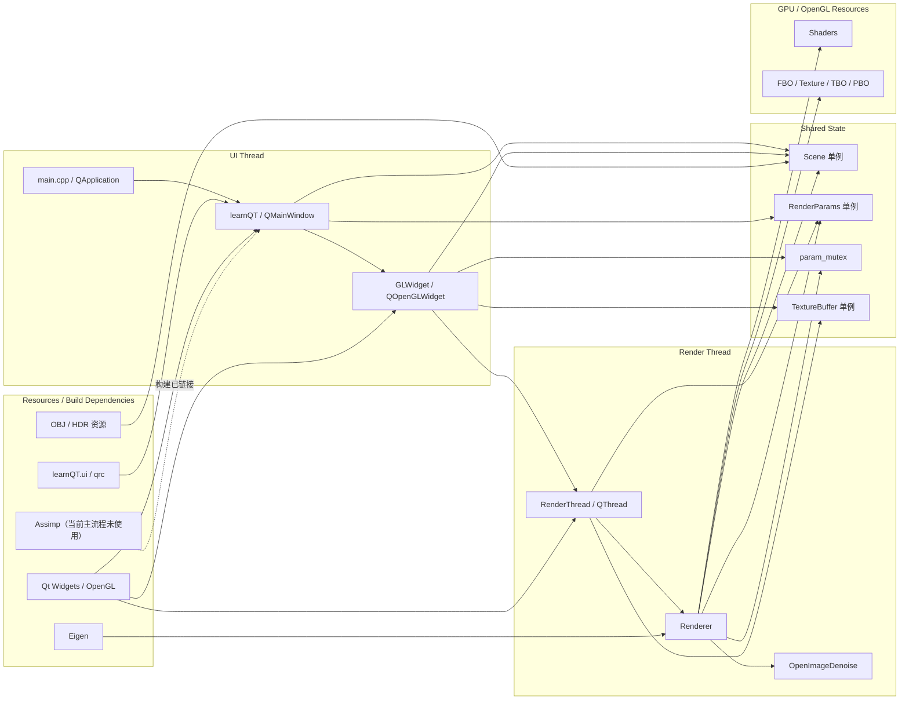
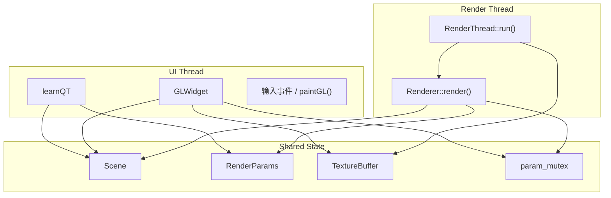

# learnQT 项目静态架构

本文档只描述项目的静态结构：模块关系、线程边界、共享状态归属，以及第三方依赖在当前实现中的位置。动态执行过程请看 [render_flow.md](./render_flow.md)。

## 总体结构图

这张图要点如下：

- `learnQT` 是 UI 顶层窗口，负责创建界面控件、连接信号槽，并在构造阶段触发 `Scene::getInstance()`。
- `GLWidget` 仍在 `UI Thread` 中，但它不是渲染核心；它更像一个显示层和交互层，用来启动 `RenderThread`、接收 `imageReady()`，以及把输入事件转成对 `Scene` 或 `RenderParams` 的更新。
- `RenderThread` 持有共享的 OpenGL context，并持续调用 `Renderer::render()`。
- `Renderer` 是真正的渲染核心，负责 shader 管理、FBO/纹理/TBO/PBO、场景数据上传、路径追踪 pass、历史帧保存、OIDN 降噪和最终合成。
- `Scene`、`RenderParams`、`TextureBuffer`、`param_mutex` 是跨模块的共享点。

## 线程边界

当前实现的线程边界很明确：

- `learnQT` 和 `GLWidget` 只在 Qt 主线程里跑。
- `RenderThread` 和 `Renderer` 只在 worker 线程里跑。
- `Scene` 不是线程安全容器本身；它依赖全局 `param_mutex` 做部分保护。
- `RenderParams` 通过 `std::atomic` 保存参数，本身比 `Scene` 更适合跨线程读写。
- `TextureBuffer` 用内部 `QMutex` 保护跨线程共享纹理的更新和绘制。

## 核心模块职责

| 模块 | 职责 | 上游 | 下游 |
| --- | --- | --- | --- |
| `main.cpp` | 创建 `QApplication` 和主窗口，启动 Qt 事件循环。 | 进程入口 | `learnQT` |
| `learnQT` | 组装 UI、连接控件信号、触发 `Scene` 初始化、转发部分 UI 参数更新。 | `main.cpp` | `GLWidget`、`Scene`、`RenderParams` |
| `GLWidget` | 在主线程中显示最终图像，接收键鼠输入，创建并启动 `RenderThread`。 | `learnQT` | `RenderThread`、`Scene`、`TextureBuffer` |
| `RenderThread` | 建立共享 OpenGL context，驱动持续渲染循环，并把结果通知主线程刷新。 | `GLWidget` | `Renderer`、`TextureBuffer` |
| `Renderer` | 渲染核心，管理 GPU 资源、shader、OIDN、路径追踪 pass 和合成 pass。 | `RenderThread` | GPU 资源、`TextureBuffer` |
| `Scene` | 场景单例，保存相机、三角形、BVH、HDR 数据和编码后的 GPU 输入。 | `learnQT`、`GLWidget` | `Renderer` |
| `RenderParams` | 跨线程参数注册表，保存是否降噪、低分辨率、分块渲染、环境贴图开关等。 | `learnQT`、`RenderThread` | `Renderer` |
| `TextureBuffer` | 作为显示桥接层，接收渲染线程输出并供主线程 `paintGL()` 绘制。 | `RenderThread` | `GLWidget` |

## 共享状态归属

| 状态 | 创建位置 | 主要写入方 | 主要读取方 | 同步方式 |
| --- | --- | --- | --- | --- |
| `Scene` | `learnQT` 构造阶段通过 `Scene::getInstance()` 初始化 | `Scene::Scene()`、`GLWidget` 的相机输入、理论上的材质更新 | `Renderer::updateparam()` | 依赖 `param_mutex` 保护写入和上传阶段 |
| `RenderParams` | `RenderParams::instance()` | `learnQT` 的 UI 槽函数、`RenderThread::setRenderLow()`、`RenderThread::setDenoise()` | `Renderer::updateRenderParameters()` | 内部 `std::atomic` |
| `TextureBuffer` | `TextureBuffer::instance()` | `RenderThread` | `GLWidget::paintGL()` | 内部 `QMutex` |
| `param_mutex` | 全局对象，定义在 `src/glwidget.cpp` | `learnQT`、`GLWidget`、`Renderer` | 同上 | 粗粒度互斥 |

这里最重要的理解是：

- `Scene` 保存的是“重资产”数据，包括 CPU 侧三角形、BVH 和编码后的 GPU 输入。
- `RenderParams` 保存的是“轻量控制参数”，例如是否降噪、是否低分辨率、tile size 等。
- `TextureBuffer` 不负责渲染，只负责把 worker 线程的最终图像安全地带回主线程显示。

## 第三方依赖在当前实现中的位置

| 依赖 | 当前作用 | 所在位置 |
| --- | --- | --- |
| Qt Widgets / Core / Gui / OpenGL | 窗口、控件、事件循环、线程、OpenGL 封装 | UI 层和线程管理层 |
| OpenGL 3.3 Core | shader、FBO、纹理、buffer、最终显示 | `Renderer` 和 `GLWidget` |
| OpenImageDenoise | 对 `RenderColorTex` 做降噪，辅以 normal / albedo | `Renderer` 的后处理阶段 |
| Eigen | 对 `view` 矩阵做求逆处理 | `Renderer::updateparam()` |
| Assimp | 已在 `CMakeLists.txt` 中链接，但当前主流程未见实际调用 | 构建依赖层 |

当前代码里 `MeshLoader` 读取 OBJ 使用的是自写解析逻辑，而不是 Assimp。理解这一点很重要，因为它意味着：

- 几何导入行为现在主要受 `src/Mesh.cpp` 控制。
- 如果后续切到 Assimp，影响范围不会只是在构建脚本，还会改变当前场景装载链路。
