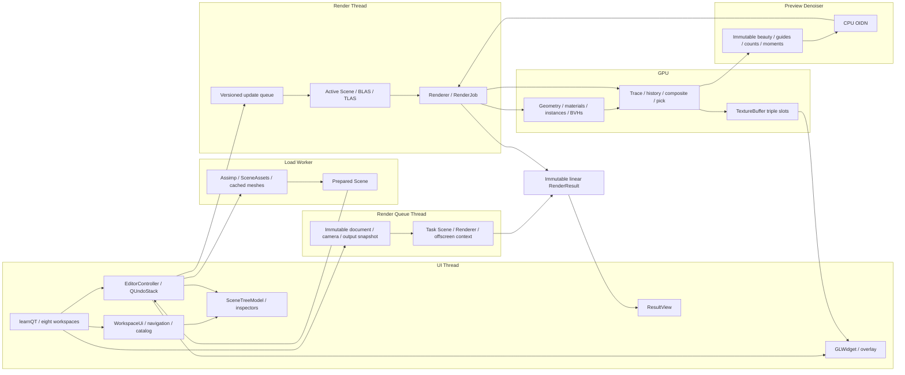

# learnQT 项目架构

## 模块与线程

```mermaid
flowchart LR
    subgraph UI[UI Thread]
        Window[learnQT / eight workspaces]
        Pages[WorkspaceUi / navigation / catalog]
        Editor[EditorController / QUndoStack]
        Tree[SceneTreeModel / inspectors]
        View[GLWidget / overlay]
        Result[ResultView]
        Window --> Pages
        Pages --> Tree
        Window --> Editor
        Editor --> Tree
        Editor --> View
    end
    subgraph Load[Load Worker]
        Assets[Assimp / SceneAssets / cached meshes]
        Candidate[Prepared Scene]
        Assets --> Candidate
    end
    subgraph RT[Render Thread]
        Queue[Versioned update queue]
        Scene[Active Scene / BLAS / TLAS]
        Renderer[Renderer / RenderJob]
        Queue --> Scene --> Renderer
    end
    subgraph Denoise[Preview Denoiser]
        Snapshot[Immutable beauty / guides / counts / moments]
        OIDN[CPU OIDN]
        Snapshot --> OIDN
    end
    subgraph Formal[Render Queue Thread]
        Request[Immutable document / camera / output snapshot]
        TaskScene[Task Scene / Renderer / offscreen context]
        Request --> TaskScene
    end
    Film[Immutable linear RenderResult]
    subgraph GPU[GPU]
        Tables[Geometry / materials / instances / BVHs]
        Passes[Trace / history / composite / pick]
        Bridge[TextureBuffer triple slots]
        Tables --> Passes --> Bridge
    end
    Editor --> Assets
    Candidate --> Editor
    Editor --> Queue
    Renderer --> Tables
    Renderer --> Passes
    Passes --> Snapshot
    OIDN --> Renderer
    Bridge --> View
    Window --> Request
    TaskScene --> Film --> Result
    Renderer --> Film
```

| 模块 | 当前职责 |
| --- | --- |
| `main.cpp` | CLI、Qt 高 DPI 和交换间隔设置；无参数建立空文档并默认进入首页；回归测试隔离偏好存储。 |
| `learnQT` | 中文 Fusion 工作台、固定分区布局、场景读写、导入、输出任务和状态栏。 |
| `WorkspacePages.cpp` / `WorkspaceUi` | 八页描述表路由与照明标签、渲染两模式、各页左右/底部面板、共享资源目录、最近文件、偏好和独立任务展示记录。 |
| `WorkbenchStyle` | 深蓝灰与亮蓝样式、按 DPI 绘制的线性图标；不添加渲染或资源加载依赖。 |
| `EditorController` | UI 文档副本、共享选择、材质作用域、撤销重做、后台准备与编辑命令。 |
| `SceneTreeModel` | 三列对象树、编辑/拖放协议；搜索由代理模型完成。 |
| `GLWidget` | UI 相机、GPU 拾取请求、选择轮廓和操纵器；绘制显示桥提供的图像。 |
| `SceneDocument` / `SceneAssets` | v1/v2 验证、路径重定位、原子保存、便携包和依赖解析。 |
| `MeshGeometry` / `SceneGraph` | 共享局部网格、BLAS、世界包围盒、TLAS SAH/refit、CPU 对照求交及按需缓存闭合边界判定。 |
| `RenderQueueThread` / `RenderQueueUi` | 不可变文档／相机／输出快照、独立工作线程与 GL 上下文、队列控制、结果固定浏览、自动导出及只读任务元数据；队列不跨会话恢复。 |
| `RenderThread` | 消费候选场景/文档、正式任务状态机、批次完成 fence、统计和结果发布。 |
| `Renderer` | GPU 表、2–4 个材质纹理池及预算、shader 变体、固定维度采样、分块预算、历史帧、合成、拾取、GPU 降噪和 OIDN 读回；开发 profile 单独编译。 |
| `PreviewDenoiser` | 单个独立 CPU 后台过滤任务，最多使用 4 个 CPU 线程并保留 UI 运行余量。 |
| `TextureBuffer` | 三槽纹理的生产、消费和版本保护；GL 复制/绘制位于短元数据锁之外。 |

## 状态归属与同步

- UI 通过 `navigateWorkspace(WorkspacePage)` 切换首页、场景、材质、照明、相机、渲染、资源、设置。`GLWidget` 始终属于同一宿主，不因切页销毁或重设父级；页面共用一份选择和 undo。
- 固定位置的 `QDockWidget` 使用 `NoDockWidgetFeatures`，保留尺寸调整、隐藏和恢复，不允许用户自由浮动或重排。首页、资源、设置使用全幅页；场景、材质、照明、相机及渲染构图模式使用同一编辑视口，渲染结果模式使用 ResultView。
- `WorkspaceUi` 的八页及渲染两模式布局使用 `workspaceV5/layout/` 稳定键和 saveState 版本 5，模式与照明标签也保存在 V5；欢迎、工具提示、状态栏、最近文件及吸附等偏好继续使用 V4。不写入场景；搜索在会话内独立保留。
- UI 使用 `EditorController::document` 和 `GLWidget::camera`，正常编辑不直接写活动 Scene。创建渲染线程前的同步初始化是例外。
- 运行中的 Scene 由 Render Thread 修改；Load Worker 构建独立候选实例，几何通过只读共享资源缓存复用。
- UI 的提交接口只更新短队列；GPU fence 完成后才应用最新文档及资源变动。没有覆盖整帧的 `m_frameMutex`。
- `controlRevision` 标记新输入；批次在后续 tile 提交前检查编辑、拾取、暂停、停止、预览显隐和退出。已提交 GPU 工作完成后才能安全替换资源。
- `RenderParams::Snapshot` 在一个批次内只读，包含 uint32 `sampleSeed` 和 0–64 的 `rrMinDepth`；预览与正式任务分别持有设置，提交快照不受后续编辑影响。`param_mutex` 仍用于部分旧同步函数，但不是 UI 等待整帧渲染的主要协议。
- GPU 几何/材质/实例/加速表、PBO 和降噪上传纹理由 Render Thread 管理。UI 管理自身绘制资源及显示槽消费 fence。
- OIDN 后台任务只拿不可变图像、有效计数、二阶矩与保护掩码。三路 RGBA PBO 在同一 fence 后映射，CPU 提取 RGB 特征；场景、相机或尺寸改变取消旧任务，发布时核对累积版本和尺寸。
- `RenderResultPtr` 为 `shared_ptr<const RenderResult>`。GL 线程从最后完整历史读回后发布 CPU 结果；队列/UI 持有线性 beauty、匹配降噪图、guide/AOV 与元数据。ResultView 在 CPU 重曝光、切显示曲线/通道，记住各会话历史结果的查看设置；不访问 GL 或修改累积。
- EXR 是无额外运行时依赖的 v2 无压缩 scanline 写出器，原子保存 HALF/FLOAT。浮点历史缓存和新增 PBO/CPU 数据尚未纳入完整提交前场景资源预算。
- 显示槽具有 `writing`、`reading`、`pending` 状态以及 producer/consumer fence。未消费的当前版本图像不会被覆盖，旧场景版本可回收。

## 资源与依赖

实例引用同源网格的局部 BLAS。变换只更新实例、TLAS 和灯光分布；材质更新不重建 BVH，组织变动不上传几何。撤销需要的缓存由文档及 undo 命令持有，清空历史后才可释放不再引用的资源。

材质纹理按颜色/数据语义建立视图，颜色先解码到线性再缩放/生成 mip。纹理池按尺寸和格式分组，最低纹理单元能力使用两个池，容量允许时使用四个池；默认 512 MiB 材质纹理预算含 mip，超预算缩小池并报告，超层数明确回退常量。这是纹理容量估算，尚非完整场景预算或驱动显存测量。surface PDF 及稀疏精确接触界面记录打包到材质 GPU buffer 的尾部，降低 sampler 单元压力。相机、边界材质/变换及场景同步时使用 CPU BLAS 判定初始嵌套介质；复用 shader 也重新上传初始栈；栈和界面运行时实例身份不写场景 JSON。

Qt 5 Widgets/Core/Gui/OpenGL 负责窗口、线程、JSON 和图像；OpenGL 3.3 Core 负责渲染和共享纹理；Assimp 负责 OBJ/glTF/GLB/FBX；OIDN 2.3.3 负责降噪。Eigen 仍为构建依赖。`.ui`/qrc 保留在工程中，当前工作台主要由代码构建。

正式队列使用独立尺寸、反弹和采样预算；RenderQueueThread 拥有任务快照对应的运行时、离屏上下文和 Renderer，串行出图并执行最终降噪。编辑 Render Thread 保持独立，队列期间可继续编辑并使用光栅化预览。旧直接正式任务路径仍锁定编辑。预览降噪使用异步任务，正式最终降噪支持取消。见 [工作台专题](./scene_workbench_v2.md)。

采样/光源 profile 不改变线程归属：应用访问计数写入专用辅助附件并离屏读回，不能同时用其作为降噪特征；生产计时使用未插桩变体。诊断捕获也使用专用辅助附件，不能与 profile/降噪同时启用；普通生产不逐轮读回诊断。最新实现、验证与边界见 [2026-10-03 第四、五批渲染验收](./render_batches_4_5_2026-10-03.md)；前三批记录保留原时点。
