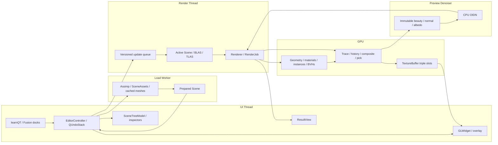

# learnQT 项目架构

## 模块与线程

```mermaid
flowchart LR
    subgraph UI[UI Thread]
        Window[learnQT / Fusion docks]
        Editor[EditorController / QUndoStack]
        Tree[SceneTreeModel / inspectors]
        View[GLWidget / overlay]
        Result[ResultView]
        Window --> Editor
        Editor --> Tree
        Editor --> View
    end
    subgraph Load[Load Worker]
        Assets[Assimp / SceneAssets / cached meshes]
        Candidate[Prepared Scene]
        Assets --> Candidate
    end
    subgraph RT[Render Thread]
        Queue[Versioned update queue]
        Scene[Active Scene / BLAS / TLAS]
        Renderer[Renderer / RenderJob]
        Queue --> Scene --> Renderer
    end
    subgraph Denoise[Preview Denoiser]
        Snapshot[Immutable beauty / normal / albedo]
        OIDN[CPU OIDN]
        Snapshot --> OIDN
    end
    subgraph GPU[GPU]
        Tables[Geometry / materials / instances / BVHs]
        Passes[Trace / history / composite / pick]
        Bridge[TextureBuffer triple slots]
        Tables --> Passes --> Bridge
    end
    Editor --> Assets
    Candidate --> Editor
    Editor --> Queue
    Renderer --> Tables
    Renderer --> Passes
    Passes --> Snapshot
    OIDN --> Renderer
    Bridge --> View
    Renderer --> Result
```

| 模块 | 当前职责 |
| --- | --- |
| `main.cpp` | CLI、Qt 高 DPI 和交换间隔设置；无参数启动空场景。 |
| `learnQT` | 中文 Fusion 工作台、停靠布局、场景读写、导入、输出任务和状态栏。 |
| `EditorController` | UI 文档副本、共享选择、材质作用域、撤销重做、后台准备与编辑命令。 |
| `SceneTreeModel` | 三列对象树、编辑/拖放协议；搜索由代理模型完成。 |
| `GLWidget` | UI 相机、GPU 拾取请求、选择轮廓和操纵器；绘制显示桥提供的图像。 |
| `SceneDocument` / `SceneAssets` | v1/v2 验证、路径重定位、原子保存、便携包和依赖解析。 |
| `MeshGeometry` / `SceneGraph` | 共享局部网格、BLAS、世界包围盒、TLAS SAH/refit、CPU 对照求交。 |
| `RenderThread` | 消费候选场景/文档、正式任务状态机、批次完成 fence、统计和结果发布。 |
| `Renderer` | GPU 表、shader、分块预算、历史帧、按需合成、拾取和 OIDN 读回。 |
| `PreviewDenoiser` | 单个独立 CPU 后台过滤任务，最多使用 4 个 CPU 线程并保留 UI 运行余量。 |
| `TextureBuffer` | 三槽纹理的生产、消费和版本保护；GL 复制/绘制位于短元数据锁之外。 |

## 状态归属与同步

- UI 使用 `EditorController::document` 和 `GLWidget::camera`，正常编辑不直接写活动 Scene。创建渲染线程前的同步初始化是例外。
- 运行中的 Scene 由 Render Thread 修改；Load Worker 构建独立候选实例，几何通过只读共享资源缓存复用。
- UI 的提交接口只更新短队列；GPU fence 完成后才应用最新文档及资源变动。没有覆盖整帧的 `m_frameMutex`。
- `controlRevision` 标记新输入；批次在后续 tile 提交前检查编辑、拾取、暂停、停止、预览显隐和退出。已提交 GPU 工作完成后才能安全替换资源。
- `RenderParams::Snapshot` 在一个批次内只读。`param_mutex` 仍用于部分旧同步函数，但不是 UI 等待整帧渲染的主要协议。
- GPU 几何/材质/实例/加速表、PBO 和降噪上传纹理由 Render Thread 管理。UI 管理自身绘制资源及显示槽消费 fence。
- OIDN 后台任务只拿图像副本。场景、相机或尺寸改变会取消旧任务，结果必须匹配累积版本与尺寸才可发布。
- 显示槽具有 `writing`、`reading`、`pending` 状态以及 producer/consumer fence。未消费的当前版本图像不会被覆盖，旧场景版本可回收。

## 资源与依赖

实例引用同源网格的局部 BLAS。变换只更新实例、TLAS 和灯光分布；材质更新不重建 BVH，组织变动不上传几何。撤销需要的缓存由文档及 undo 命令持有，清空历史后才可释放不再引用的资源。

Qt 5 Widgets/Core/Gui/OpenGL 负责窗口、线程、JSON 和图像；OpenGL 3.3 Core 负责渲染和共享纹理；Assimp 负责 OBJ/glTF/GLB/FBX；OIDN 2.3.3 负责降噪。Eigen 仍为构建依赖。`.ui`/qrc 保留在工程中，当前工作台主要由代码构建。

正式出图使用独立尺寸、反弹和采样预算，在工作期间锁定编辑。预览降噪异步，正式任务最终降噪在渲染线程同步执行并支持取消。流程和未覆盖边界见 [工作台专题](./scene_workbench_v2.md)。
