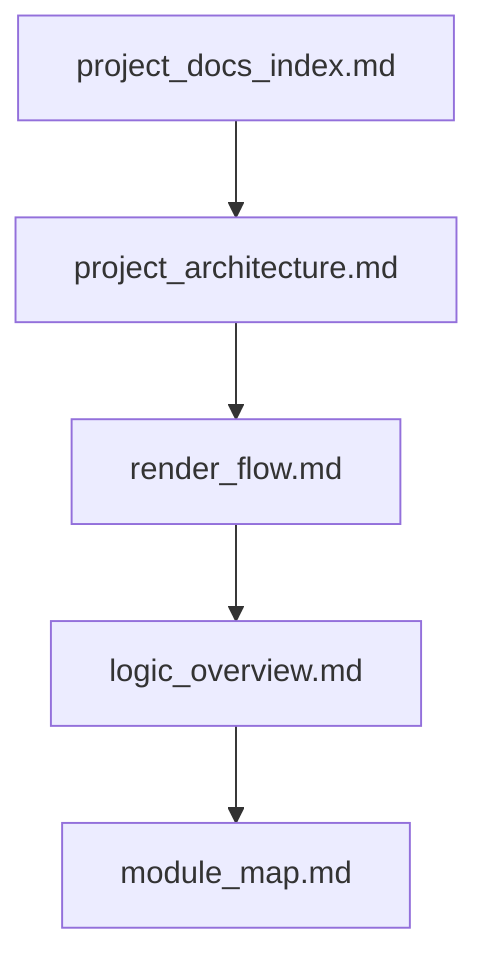

# learnQT 项目文档入口

当前工程是一个基于 Qt + OpenGL 的离线路径追踪实验项目：`UI Thread` 负责窗口与输入，`Render Thread` 负责渲染循环、路径追踪和降噪，`Shared State` 负责在两条线程之间传递场景、参数和最终显示纹理。

本文档是 `miscellaneous` 下项目理解资料的总入口。所有说明都以当前代码实现为准，优先回答“代码现在怎么工作”，而不是“理想上应该怎样设计”。

## 推荐阅读顺序

这条顺序对应的阅读目标是：

1. 先看 [project_architecture.md](./project_architecture.md)，建立模块和线程边界。
2. 再看 [render_flow.md](./render_flow.md)，理解程序启动、单帧渲染和交互更新。
3. 接着看 [logic_overview.md](./logic_overview.md)，理解场景准备、GPU 上传和 shader 内部逻辑。
4. 最后看 [module_map.md](./module_map.md)，把理解映射回具体目录和关键文件。

如果你当前的目标是直接开始读代码，可以先看架构文档，再直接跳到模块地图。

## 文档分工

| 文档 | 负责内容 | 不负责内容 |
| --- | --- | --- |
| [project_architecture.md](./project_architecture.md) | 静态结构、线程边界、共享状态归属、第三方依赖位置 | 单帧执行细节、shader bounce 细节 |
| [render_flow.md](./render_flow.md) | 启动流程、单帧渲染流程、交互触发流程 | 目录级代码地图、文件阅读建议 |
| [logic_overview.md](./logic_overview.md) | 场景准备链路、GPU 数据上传、shader 主循环、当前真实行为 | 模块职责总览、文档导航 |
| [module_map.md](./module_map.md) | 主要目录和关键文件的阅读入口、依赖关系、改动影响 | 完整流程图、状态同步细节 |

## 统一术语

| 术语 | 含义 |
| --- | --- |
| `UI Thread` | Qt 主线程，负责 `QApplication`、`learnQT`、`GLWidget` 的窗口与输入事件。 |
| `Render Thread` | `RenderThread` 所在线程，持有共享 OpenGL 上下文并持续执行渲染循环。 |
| `GPU` | shader、FBO、纹理、TBO、PBO 等 OpenGL 资源所在的执行区域。 |
| `Shared State` | 在主线程和渲染线程之间共享或同步的状态，如 `Scene`、`RenderParams`、`TextureBuffer`、`param_mutex`。 |
| `Pass` | 一次渲染阶段，例如 `pathtrace.frag`、`historysave.frag`、`triangle.frag`。 |
| `历史帧` | `preRenderColorTex` 中保存的上一次完整累积结果，用于渐进式路径追踪。 |
| `分块渲染` | `useTileRendering` 为真时，只渲染当前 tile，全部 tile 完成后才算完成一轮累积。 |

## 图例约定

后续所有图统一遵循下面的逻辑分区：

- `UI Thread`: 用户输入、Qt UI、窗口显示。
- `Render Thread`: 渲染循环、参数同步、OpenGL worker。
- `GPU`: path tracing、历史帧保存、最终合成等图形 pass。
- `Shared State`: 场景数据、参数、跨线程共享纹理和同步原语。

如果某个第三方库不在 GPU 上执行，但又直接参与渲染链路，例如 OIDN，会放在 `Render Thread` 一侧并在说明里明确其作用。

## 使用建议

- 想回答“程序从哪里开始跑”：先看 [render_flow.md](./render_flow.md) 的启动流程。
- 想回答“谁驱动谁”：先看 [project_architecture.md](./project_architecture.md)。
- 想回答“场景和 HDR 怎么进 shader”：先看 [logic_overview.md](./logic_overview.md)。
- 想回答“应该从哪些文件下手读”：先看 [module_map.md](./module_map.md)。

## 当前文档边界

这批文档刻意不单独拆出 `known_issues.md` 或 `refactor_roadmap.md`。当前实现中的问题、限制和半成品设计，统一收敛在 [logic_overview.md](./logic_overview.md) 的“当前实现注意点”一节里。
