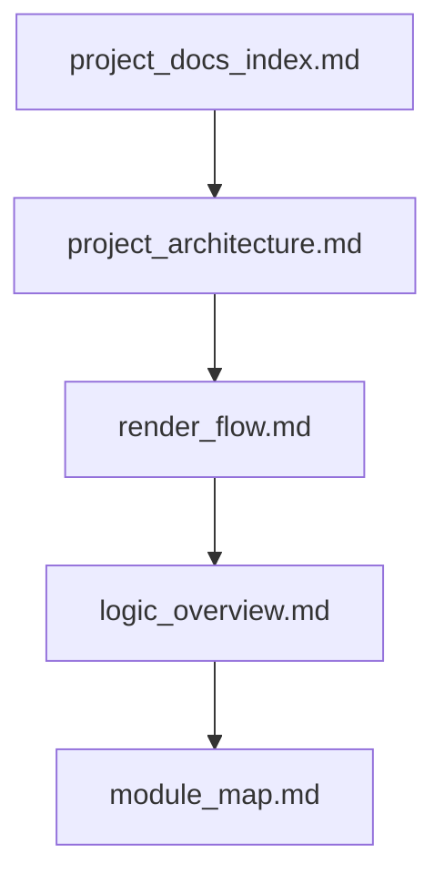

# learnQT 项目文档入口

当前工程是一个基于 Qt + OpenGL 的离线路径追踪实验项目：`UI Thread` 负责窗口与输入，`Render Thread` 负责渲染循环、路径追踪和降噪，`Load Worker` 准备候选场景及便携包，`Shared State` 在主线程和渲染线程之间同步当前场景、参数和最终显示纹理。

2026-09-04：纹理与场景系统 v1 已收尾。功能范围、两个预设、保存/便携导出、验收记录及兼容性边界集中在 [texture_scene_v1.md](./texture_scene_v1.md)。

2026-09-05：基础直接光采样阶段完成，Release 构建及 9/9 CTest 通过。概率同步、HDR 分布、解析光源 MIS、alpha 发光面、delta 和均匀介质采样的实现及验证边界见 [direct_lighting.md](./direct_lighting.md)。

本文档是 `miscellaneous` 下项目理解资料的总入口。所有说明都以当前代码实现为准，优先回答“代码现在怎么工作”，而不是“理想上应该怎样设计”。

## 推荐阅读顺序

这条顺序对应的阅读目标是：

1. 先看 [project_architecture.md](./project_architecture.md)，建立模块和线程边界。
2. 再看 [render_flow.md](./render_flow.md)，理解程序启动、单帧渲染和交互更新。
3. 接着看 [logic_overview.md](./logic_overview.md)，理解场景准备、GPU 上传和 shader 内部逻辑。
4. 最后看 [module_map.md](./module_map.md)，把理解映射回具体目录和关键文件。

如果你当前的目标是直接开始读代码，可以先看架构文档，再直接跳到模块地图。

## 文档分工

| 文档 | 负责内容 | 不负责内容 |
| --- | --- | --- |
| [project_architecture.md](./project_architecture.md) | 静态结构、线程边界、共享状态归属、第三方依赖位置 | 单帧执行细节、shader bounce 细节 |
| [render_flow.md](./render_flow.md) | 启动流程、单帧渲染流程、交互触发流程 | 目录级代码地图、文件阅读建议 |
| [logic_overview.md](./logic_overview.md) | 场景准备链路、GPU 数据上传、shader 主循环、当前真实行为 | 模块职责总览、文档导航 |
| [module_map.md](./module_map.md) | 主要目录和关键文件的阅读入口、依赖关系、改动影响 | 完整流程图、状态同步细节 |
| [to-do.md](./to-do.md) | 已知正确性问题、采样质量问题、架构和验证待办 | 当前代码流程说明 |
| [texture_scene_v1.md](./texture_scene_v1.md) | 纹理/场景 v1 使用方式、格式、预设、回归基线和支持边界 | 未实现功能的完成承诺 |
| [direct_lighting.md](./direct_lighting.md) | 光源概率与 PDF、表面/体积 NEE 和 MIS、delta、透射率、数值验收及限制 | 相机/后处理选项和性能优化计划 |

## 统一术语

| 术语 | 含义 |
| --- | --- |
| `UI Thread` | Qt 主线程，负责 `QApplication`、`learnQT`、`GLWidget` 的窗口与输入事件。 |
| `Render Thread` | `RenderThread::run()` 执行的 worker 线程，使用共享 OpenGL 上下文持续渲染；QThread 对象本身及部分控制入口仍在主线程。 |
| `Load Worker` | 运行中的场景切换/模型导入/便携导出所用后台任务；CPU 候选场景不直接修改当前单例或 GPU。 |
| `GPU` | shader、FBO、纹理、TBO、PBO 等 OpenGL 资源所在的执行区域。 |
| `Shared State` | 在主线程和渲染线程之间共享或同步的状态，如 `Scene`、`RenderParams`、`TextureBuffer`、`param_mutex`。 |
| `Pass` | 一次渲染阶段，例如 `pathtrace.frag`、`historysave.frag`、`triangle.frag`。 |
| `历史帧` | `preRenderColorTex` 中保存的上一次完整累积结果，用于渐进式路径追踪。 |
| `分块渲染` | `useTileRendering` 为真时，只渲染当前 tile，全部 tile 完成后才算完成一轮累积。 |
| `NEE` | 在表面或体积散射点显式选择光源和方向，并查询该连接上的可见性/透射率。 |
| `MIS` | 使用 NEE 与 BSDF/phase 采样各自的 PDF 对贡献加权；连续方向 PDF 使用每单位立体角测度。 |
| `delta 事件` | 理想镜面反射或折射等离散方向事件，使用概率质量，不伪造连续方向 PDF。 |
| `体积栈` | 每条 GPU 路径保存的均匀介质 LIFO 栈；与程序线程、CPU 场景栈或折射率栈无关。 |

## 图例约定

后续所有图统一遵循下面的逻辑分区：

- `UI Thread`: 用户输入、Qt UI、窗口显示。
- `Render Thread`: 渲染循环、参数同步、OpenGL worker。
- `Load Worker`: 独立候选场景准备及资源包构建，不持有渲染上下文。
- `GPU`: path tracing、历史帧保存、最终合成等图形 pass。
- `Shared State`: 场景数据、参数、跨线程共享纹理和同步原语。

如果某个第三方库不在 GPU 上执行，但又直接参与渲染链路，例如 OIDN，会放在 `Render Thread` 一侧并在说明里明确其作用。

## 使用建议

- 想回答“程序从哪里开始跑”：先看 [render_flow.md](./render_flow.md) 的启动流程。
- 想回答“谁驱动谁”：先看 [project_architecture.md](./project_architecture.md)。
- 想回答“场景和 HDR 怎么进 shader”：先看 [logic_overview.md](./logic_overview.md)。
- 想回答“应该从哪些文件下手读”：先看 [module_map.md](./module_map.md)。
- 想回答“贴图支持到哪、场景怎么保存和搬移”：看 [texture_scene_v1.md](./texture_scene_v1.md)。
- 想回答“直接光照如何采样、体积支持到哪、哪些数值已验证”：看 [direct_lighting.md](./direct_lighting.md)。

## 当前文档边界

当前实现中的真实行为和限制写在 [logic_overview.md](./logic_overview.md) 及相关专题；需要后续处理的正确性、采样质量和架构项统一收敛在 [to-do.md](./to-do.md)。
