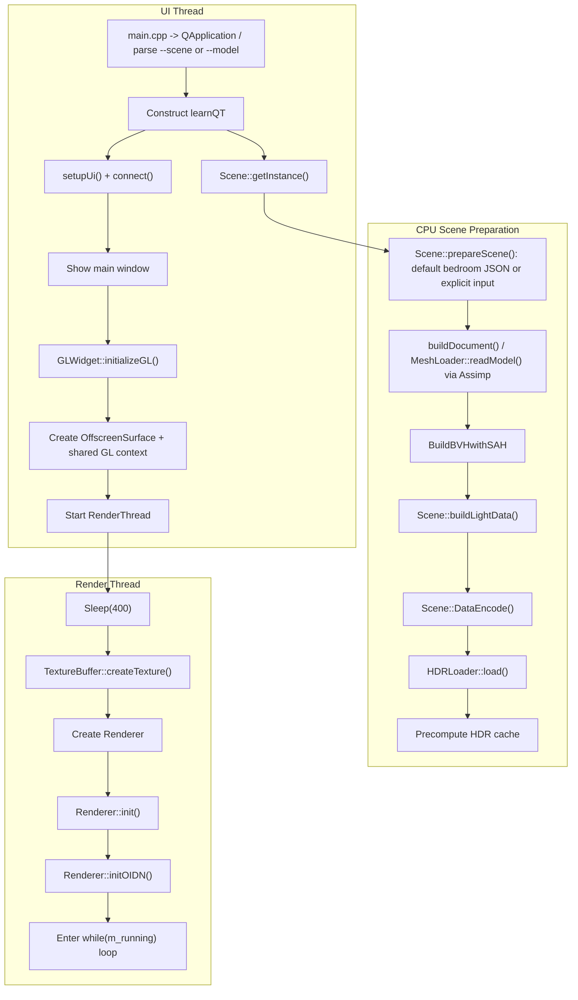
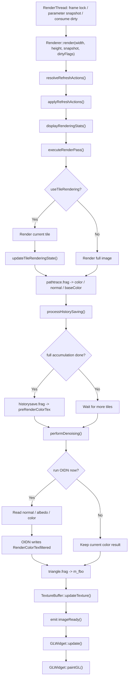
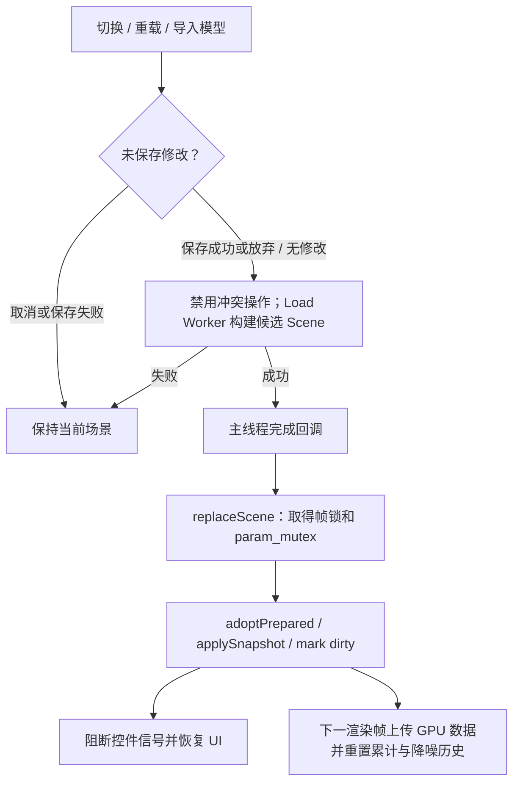

# learnQT 渲染流程

本文档只讲动态流程，不重复解释模块职责。静态结构请看 [project_architecture.md](./project_architecture.md)。

## 1. 启动初始化流程

这个启动流程的关键点是：

- `Scene` 在 `learnQT` 构造阶段就初始化完成，所以渲染线程启动时，CPU 侧场景已经准备好。
- 默认输入为 `resources/scenes/bedroom.scene.json`；`--model` 产生可保存的新文档，`--scene` 与它同时出现时报错。首次启动仍同步准备 CPU 数据，不要与后面的后台切换混淆。
- `GLWidget::initializeGL()` 并不直接渲染复杂内容，它主要做两件事：建立展示用 OpenGL 状态，以及启动渲染线程。
- `RenderThread` 不是按需工作，而是一旦启动就进入持续渲染循环。

## 2. 单帧渲染流程

把这条链路拆开理解：

- `resolveRefreshActions()` 负责检查参数变化和 scene dirty flags，并决定是否需要重建 shader、重算分辨率、重置 tile 状态、重上传场景或重传材质。
- `applyRefreshActions()` 在帧首一次性执行这些动作，避免 render pass 中途改变场景资源。
- `executeRenderPass()` 是核心路径追踪阶段，输出 3 个附件：颜色、法线、底色。
- path tracing pass 读取 triangles / BVH / lights TBO、材质纹理数组、采样元数据及 HDR cache。每条射线先取最近几何/解析球交点，再处理到交点前的介质自由程或衰减，最后才累计交点或无限远发光。
- 表面在存在连续 BSDF 波瓣时执行 NEE，体积散射点执行 NEE/phase MIS；旧 Transparent 边界只更新体积栈并继续，纯 delta 表面跳过 NEE。完整路径顺序见 [logic_overview.md](./logic_overview.md) 和 [direct_lighting.md](./direct_lighting.md)。
- `processHistorySaving()` 只有在整图模式或 tile 模式完成一整轮时，才会把当前结果写回 `preRenderColorTex` 用于下一轮累积。
- `performDenoising()` 不是每次循环都执行；降噪开启时通常在首个完整累计轮次、每 100 个完整轮次、显式刷新或到达累计上限的最终帧触发。
- 达到 `maxRenderFrames` 后停止增加路径追踪累计，但线程仍显示最后的结果；新的场景或参数刷新会重置累计。
- `TextureBuffer` 是从渲染线程回到主线程显示的桥。

## 3. 用户交互触发更新流程

交互流程里最容易忽略的几个点：

- 相机输入直接改的是 `Scene::camera`，不是 `RenderParams`。
- 鼠标拖动时会把 `renderLow` 设为 `true`，松开再恢复，这样交互期间会降到较低分辨率以换取响应速度。
- `markSceneDirty()` 只是告诉渲染线程“有场景状态需要同步”，真正决定怎么更新的是下一轮 `Renderer::resolveRefreshActions()` / `applyRefreshActions()`。
- `Scene::updateMaterial()` 更新常量后重建 light CDF，并将三角形的新 `lightSelectPdf` 回写编码；下一帧的 `syncMaterialBuffer()` 同步上传三角形和 light buffer、更新 `nLights / nAnalyticLights` 并重置累计，保证 NEE 与 BSDF 命中使用同一概率。
- `Denoise` 和环境贴图开关都直接写进 `RenderParams`；环境贴图变化由下一轮参数快照触发 shader 重建和场景同步。
- 相机、材质和持久渲染设置变化还会将场景文档标记为未保存；临时交互降分辨率不单独置 dirty。

## 4. 场景切换、保存与导出

- 后台 CPU 阶段包括资源解析、模型/图片解码、BVH、灯光和 HDR cache；原场景仍可显示。
- 打开失败不替换当前文档，不清除已有未保存状态。成功加载已保存场景清除 dirty；模型导入则保留 dirty。
- 关闭前同样使用保存/放弃/取消。后台任务尚未完成时不关闭窗口。
- 保存从当前材质、相机、`RenderParams::Snapshot` 取得文档快照，重定位路径后通过 `QSaveFile` 原子提交。
- 便携导出在后台向目标旁的临时目录复制实际资源、按 SHA-256 处理同名冲突，严格限制包外访问并完整重导入后发布。
- 导出不更新当前保存路径，也不清除 dirty。格式、CLI 和资源边界见 [texture_scene_v1.md](./texture_scene_v1.md)。

## 分块渲染说明

当前的分块渲染逻辑以 `RenderParams::useTileRendering()` 和 `RenderParams::tileSize()` 为核心：

- 如果开启分块渲染，每次 `render()` 只渲染当前 tile。
- `currentTileX / currentTileY` 会在 `updateTileRenderingState()` 中推进。
- 只有当所有 tile 都完成时，才把这一轮视为“完整累积完成”，随后才会推进历史帧保存。
- 如果关闭分块渲染，则每次 `render()` 都直接渲染整张图，并立即参与历史帧累积。

## OIDN 触发条件说明

当前 `performDenoising()` 的触发条件不是“每帧必做”：

- 当 `denoise` 开关变化或 renderer 标记 `m_forceDenoiseRefresh` 时，会重新走一次降噪。
- 一般需降噪已开启、当前 tile 轮次已经完整结束，且满足“首个完整轮次或每 100 个完整轮次一次”；到达 `maxRenderFrames` 的最终帧也会触发降噪。

这意味着当前实现偏向“周期性后处理”，而不是“每个 worker 循环都实时降噪”。
