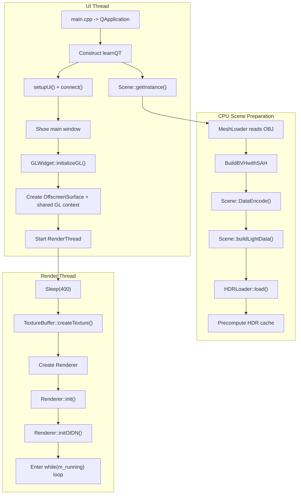
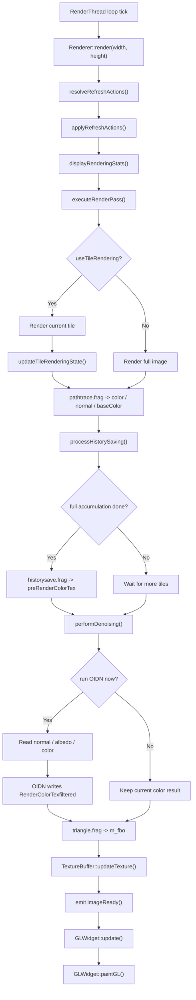
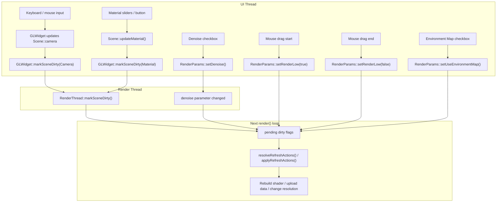

# learnQT 渲染流程

本文档只讲动态流程，不重复解释模块职责。静态结构请看 [project_architecture.md](./project_architecture.md)。

## 1. 启动初始化流程

这个启动流程的关键点是：

- `Scene` 在 `learnQT` 构造阶段就初始化完成，所以渲染线程启动时，CPU 侧场景已经准备好。
- `GLWidget::initializeGL()` 并不直接渲染复杂内容，它主要做两件事：建立展示用 OpenGL 状态，以及启动渲染线程。
- `RenderThread` 不是按需工作，而是一旦启动就进入持续渲染循环。

## 2. 单帧渲染流程

把这条链路拆开理解：

- `resolveRefreshActions()` 负责检查参数变化和 scene dirty flags，并决定是否需要重建 shader、重算分辨率、重置 tile 状态、重上传场景或重传材质。
- `applyRefreshActions()` 在帧首一次性执行这些动作，避免 render pass 中途改变场景资源。
- `executeRenderPass()` 是核心路径追踪阶段，输出 3 个附件：颜色、法线、底色。
- path tracing pass 会读取 triangles / BVH / lights 三类 texture buffer，并在 shader 中执行 BSDF 采样、显式光源采样和 MIS。
- `processHistorySaving()` 只有在整图模式或 tile 模式完成一整轮时，才会把当前结果写回 `preRenderColorTex` 用于下一轮累积。
- `performDenoising()` 不是每次循环都执行；当前逻辑下，通常在首帧、每 100 帧，或显式要求更新降噪状态时触发。
- `TextureBuffer` 是从渲染线程回到主线程显示的桥。

## 3. 用户交互触发更新流程

交互流程里最容易忽略的几个点：

- 相机输入直接改的是 `Scene::camera`，不是 `RenderParams`。
- 鼠标拖动时会把 `renderLow` 设为 `true`，松开再恢复，这样交互期间会降到较低分辨率以换取响应速度。
- `markSceneDirty()` 只是告诉渲染线程“有场景状态需要同步”，真正决定怎么更新的是下一轮 `Renderer::resolveRefreshActions()` / `applyRefreshActions()`。
- `Denoise` 和环境贴图开关都直接写进 `RenderParams`；环境贴图变化由下一轮参数快照触发 shader 重建和场景同步。

## 分块渲染说明

当前的分块渲染逻辑以 `RenderParams::useTileRendering()` 和 `RenderParams::tileSize()` 为核心：

- 如果开启分块渲染，每次 `render()` 只渲染当前 tile。
- `currentTileX / currentTileY` 会在 `updateTileRenderingState()` 中推进。
- 只有当所有 tile 都完成时，才把这一轮视为“完整累积完成”，随后才会推进历史帧保存。
- 如果关闭分块渲染，则每次 `render()` 都直接渲染整张图，并立即参与历史帧累积。

## OIDN 触发条件说明

当前 `performDenoising()` 的触发条件不是“每帧必做”：

- 当 `denoise` 开关变化或 renderer 标记 `m_forceDenoiseRefresh` 时，会重新走一次降噪。
- 否则只有在降噪已开启、当前 tile 轮次已经完整结束、并且帧数满足“首帧或每 100 帧一次”时，才执行 OIDN。

这意味着当前实现偏向“周期性后处理”，而不是“每个 worker 循环都实时降噪”。
