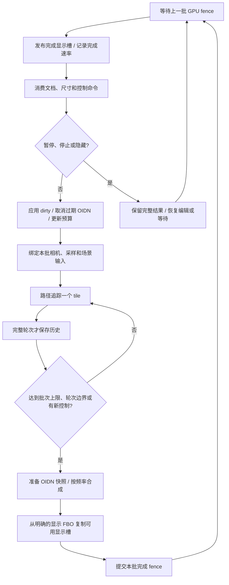

# learnQT 渲染与编辑流程

## 启动与导入

1. `main.cpp` 解析互斥的 `--scene` / `--model` 及 CLI 导出/验证参数。无参数使用空场景；CLI 模型入口保留独立场景的适配行为。
2. 首次 Scene CPU 准备完成后创建工作台。运行中的打开场景或追加模型由 Load Worker 构建候选数据。
3. `GLWidget::initializeGL()` 创建共享渲染上下文和显示 shader；Render Thread 等待 100 ms 后建立 Renderer 与显示槽。
4. OIDN 按需初始化。空背景完成一轮后停止重复采样，不启动降噪；编辑或尺寸改变会重新刷新。
5. 导入成功后整批加入选中组或根组，产生一次 undo 命令；失败保持文档、相机和 dirty 状态。打开场景替换文档，模型导入追加内容。

## 渲染循环

```mermaid
flowchart TD
    A[等待上一批 GPU fence] --> B[发布完成显示槽 / 记录完成速率]
    B --> C[消费文档、尺寸和控制命令]
    C --> D{暂停、停止或隐藏?}
    D -- 否 --> E[应用 dirty / 取消过期 OIDN / 更新预算]
    E --> F[绑定本批相机、采样和场景输入]
    F --> G[路径追踪一个 tile]
    G --> H[完整轮次才保存历史]
    H --> I{达到批次上限、轮次边界或有新控制?}
    I -- 否 --> G
    I -- 是 --> J[准备 OIDN 快照 / 按频率合成]
    J --> K[从明确的显示 FBO 复制可用显示槽]
    K --> L[提交本批完成 fence]
    L --> A
    D -- 是 --> M[保留完整结果 / 恢复编辑或等待]
    M --> A
```

- tile 尺寸按用户保存的 `tileSize` 执行，不在后台改为大块。每批最多 16 个 tile，根据当前累积版本 GPU tile 耗时，以约 8 ms 估算预算和 1.3 安全系数缩小批次；CPU 提交超过 4 ms 也结束本批。新场景/相机/尺寸从 1 个 tile 开始。
- 预算不是硬实时保证，单个极重 tile 或整图 pass 可能超时。每批不跨完整轮次，保留暂停、导出和最终降噪的快照边界。
- 场景表、sampler 和 Sobol uniform 每批绑定一次。主射线保持像素中心，随机种子用 `gl_FragCoord` 全图像素坐标，与 tile/批次布局无关。
- 预览合成约每 16 ms 执行一次；首次显示、最终图像和显示参数修改强制刷新。曝光/tone mapping 的 Display dirty 不重启采样，也能刷新已停止的预览。正式任务不为隐藏编辑视口反复合成/复制，结果视图在完整轮次取得快照。
- 显示复制明确指定 Renderer 的显示 FBO，不依赖前一 pass 遗留的绑定。没有空闲槽就跳过本次展示，继续采样。
- fence 使用有界 1 ms 等待，不在每个 tile 后用 `Sleep(1)` 轮询；未完成时不会替换 GPU 资源。

## 编辑与拾取

UI 命令修改文档副本、合并连续交互并提交版本化更新。变换预览期间 TLAS refit，结束时重建顶层树；BLAS 和几何缓冲复用。分组、排序及命名只更新组织结构。

拾取使用视口实际像素尺寸的整数 ID/深度 pass。点击经 PBO/fence 异步读回，匹配请求号和场景/相机版本后才改变选择。树与视口共享选择；Ctrl 追加/切换，树中 Shift 范围选择。轮廓、包围框和操纵器是显示层叠加，不进入 beauty、OIDN 和输出。

## OIDN

完整轮次的 beauty、normal、albedo 先复制到 PBO，等待 fence 后映射；预览任务在独立 CPU 线程运行，光追继续。初次稳定至少 250 ms 且已有 4 spp 时启动（到达采样上限可提前），任务完成后至少间隔 1 秒再启动下一次。最多一项后台降噪任务。

法线由 `[0,1]` 解码为 `[-1,1]`，albedo 保持线性；预过滤辅助图后再过滤线性 HDR beauty，预过滤不写回历史。结果检查累积版本和尺寸后才上传。正式任务在最终完整轮次同步执行 OIDN，接入取消回调。

## 正式任务与结果

状态为 `Preparing → Rendering → Denoising → Completed`，另有 `Paused / Stopped / Failed`。工作期间锁定场景、相机和参数编辑。暂停保留进度，继续恢复；停止在安全边界结束并恢复编辑，保留最后完整轮次及上次完成结果。

输出尺寸独立于窗口；缩放/平移结果或改变窗口不重启任务。PNG/JPEG 从完整结果导出，JPEG 质量 95、alpha 固定不透明；使用与查看结果一致的曝光、tone mapping 和 gamma，不含编辑叠加。

## 性能显示

每 200 ms 发布 RenderStats，曲线保留 60 秒。整图 FPS 是完成完整轮次的速率，块 FPS 是完成逻辑 tile 的速率，批次不被误计为一个 tile 或多份 spp。完成时间窗口消除 200 ms 计数造成的 0/5 跳变，实际停顿时衰减，暂停/完成显示零。曲线具有左右刻度并缓存绘制结果；状态栏显示实际光追分辨率，包括低分辨率预览。
