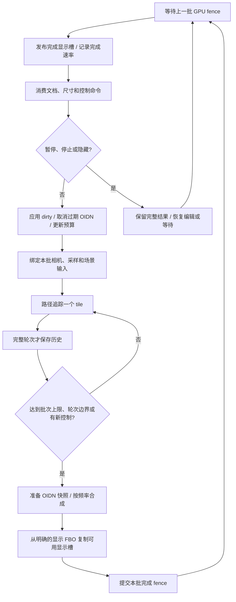

# learnQT 渲染与编辑流程

## 启动与导入

1. `main.cpp` 解析互斥的 `--scene` / `--model` 及 CLI 导出/验证参数。无参数使用空文档并默认显示欢迎首页；关闭欢迎偏好后直接进入场景页。指定场景/模型和回归入口绕过默认首页；CLI 模型入口保留独立场景的适配行为。
2. 首次 Scene CPU 准备完成后创建工作台。运行中的打开场景或追加模型由 Load Worker 构建候选数据。
3. 编辑视口首次显示时，GLWidget 初始化共享上下文和编辑 Render Thread，同时准备独立队列工作线程。首页冷启动不提前初始化 GL；F12 在其他页进入渲染构图页，渲染页加入队列。旧直接正式任务的冷启动请求仍等待 GL 就绪。
4. OIDN 按需初始化。空背景完成一轮后停止重复采样，不启动降噪；编辑或尺寸改变会重新刷新。
5. 导入成功后整批加入选中组或根组，产生一次 undo 命令；失败保持文档、相机和 dirty 状态。打开场景替换文档，模型导入追加内容。

## 工作区切换

`navigateWorkspace()` 保存上一页布局、取消未完成的变换拖动、切换周边面板并恢复目标页布局。正常浏览不修改文档或 undo；固定宿主中的 GLWidget 和 Render Thread 不重建。页面切换可能改变视口尺寸，实际分辨率改变仍会重置预览采样，不能将“不修改文档”理解为跨尺寸保留累积。

首页、资源、设置及渲染结果模式隐藏编辑预览；离开渲染页不停止队列。队列任务消费提交快照，允许继续编辑，运行期间预览临时光栅化；旧直接正式任务仍锁定编辑。队列暂停／停止在底部面板及各页渲染菜单可达，顶栏不再重复。打开／新建成功进入场景页，导入失败保留文档。

## 渲染循环

```mermaid
flowchart TD
    A[等待上一批 GPU fence] --> B[发布完成显示槽 / 记录完成速率]
    B --> C[消费文档、尺寸和控制命令]
    C --> D{暂停、停止或隐藏?}
    D -- 否 --> E[应用 dirty / 取消过期 OIDN / 更新预算]
    E --> F[绑定本批相机、采样和场景输入]
    F --> G[路径追踪一个 tile]
    G --> H[完整轮次才保存历史]
    H --> I{达到批次上限、轮次边界或有新控制?}
    I -- 否 --> G
    I -- 是 --> J[准备 OIDN 快照 / 按频率合成]
    J --> K[从明确的显示 FBO 复制可用显示槽]
    K --> L[提交本批完成 fence]
    L --> A
    D -- 是 --> M[保留完整结果 / 恢复编辑或等待]
    M --> A
```

- tile 尺寸按用户保存的 `tileSize` 执行，不在后台改为大块。每批最多 16 个 tile，根据当前累积版本 GPU tile 耗时，以约 8 ms 估算预算和 1.3 安全系数缩小批次；CPU 提交超过 4 ms 也结束本批。新场景/相机/尺寸从 1 个 tile 开始。
- 预算不是硬实时保证，单个极重 tile 或整图 pass 可能超时。每批不跨完整轮次，保留暂停、导出和最终降噪的快照边界。
- 场景表、sampler 和 Sobol uniform 每批绑定一次。AA 开启时在像素内抖动，关闭时经过中心；样本由全图像素、完整 sampleIndex、sampleSeed 和固定 dimension 定位。前 120 维用数字移位 Sobol，后续用 counter hash，alpha/透明边界使用独立事件流；整图、tile 与批次布局不改变样本域。
- RR 默认在第 3 次真实散射后开始，可设置 rrMinDepth 0–64；透射 etaScale 只校正存活概率，不修改实际 throughput。边界穿越不占散射深度，maxBounces 仍是有限深度预算。
- 预览合成约每 16 ms 执行一次；首次显示、最终图像和显示参数修改强制刷新。曝光/tone mapping 的 Display dirty 不重启采样，也能刷新已停止的预览。正式任务不为隐藏编辑视口反复合成/复制，结果视图在完整轮次取得快照。
- 显示复制明确指定 Renderer 的显示 FBO，不依赖前一 pass 遗留的绑定。没有空闲槽就跳过本次展示，继续采样。
- fence 使用有界 1 ms 等待，不在每个 tile 后用 `Sleep(1)` 轮询；未完成时不会替换 GPU 资源。

## 编辑与拾取

UI 命令修改文档副本、合并连续交互并提交版本化更新。变换预览期间 TLAS refit，结束时重建顶层树；BLAS 和几何缓冲复用。分组、排序及命名只更新组织结构。

拾取使用视口实际像素尺寸的整数 ID/深度 pass。PICKING_PASS 在最近命中和点采样 alpha 后直接返回，不执行 beauty 的法线贴图/材质/TBN 重建。点击经 PBO/fence 异步读回，匹配请求号和场景/相机版本后才改变选择。树与视口共享选择；Ctrl 追加/切换，树中 Shift 范围选择。轮廓、包围框和操纵器是显示层叠加，不进入 beauty、OIDN 和输出。

## OIDN

完整轮次的 beauty、normal、albedo 先复制到 PBO，等待 fence 后映射；预览任务在独立 CPU 线程运行，光追继续。初次稳定至少 250 ms 且已有 4 spp 时启动（到达采样上限可提前），任务完成后至少间隔 1 秒再启动下一次。最多一项后台降噪任务。

法线由 `[0,1]` 解码为 `[-1,1]`，albedo 保持线性；预过滤辅助图后再过滤线性 HDR beauty，预过滤不写回历史。结果检查累积版本和尺寸后才上传。正式任务在最终完整轮次同步执行 OIDN，接入取消回调。

## 正式任务与结果

任务状态为 Preparing → Rendering → Denoising → Completed，另有 Paused／Stopped／Failed。队列 UI 提交文档、相机及输出快照，RenderQueueThread 串行消费，后续编辑不修改请求。暂停保留进度；停止当前任务在安全边界结束，停止队列保留等待任务以便再次运行。旧直接正式任务路径锁定编辑。

预览面板和正式配置分别提供“RR 起始深度”；JSON 的 render/output 各自保存 rrMinDepth（默认 3）及 sampleSeed（默认 0，uint32 整数）。种子当前通过文件/开发 CLI 设置，没有新增种子 UI 控件。设置经场景验证、参数快照和队列/旧直接任务链路传递。

输出尺寸独立于窗口；缩放/平移结果或改变窗口不重启任务。PNG/JPEG 从完整结果导出，JPEG 质量 95、alpha 固定不透明；使用与查看结果一致的曝光、tone mapping 和 gamma，不含编辑叠加。

任务表保存提交配置与进度，完成／停止／失败时冻结。构图模式调整临时草稿，不覆盖来源相机，可保存为新相机；结果模式使用 ResultView 和只读任务属性。手动浏览历史结果后运行任务不抢走查看目标，预览统计不覆盖元数据。自动导出使用设置页本机目录，运行时验证目录，派发时生成避让冲突的路径。队列仅在当前会话保存，尚无持久恢复。

## 性能显示

性能与日志默认收起，从状态栏展开；每 200 ms 发布 RenderStats，曲线保留 60 秒。整图 FPS 是完成完整轮次的速率，块 FPS 是完成逻辑 tile 的速率，批次不被误计为一个 tile 或多份 spp。完成时间窗口消除 200 ms 计数造成的 0/5 跳变，实际停顿时衰减，暂停/完成显示零。曲线具有左右刻度并缓存绘制结果；编辑页状态栏显示实际光追分辨率，包括低分辨率预览；渲染页显示正式任务尺寸和进度。

离屏性能入口 tools/render_benchmark.py 将固定 spp、生产计时、单独插桩、参考与原始线性数据分开；tools/render_compare.py 做多种子/同时间误差和后端一致性比较。实际命令、图像与范围见 [2026-10-03 三批渲染验收](./render_batches_2026-10-03.md)。
